ARM Assembly 기초

RISC - Reduced Instruction Set Compiler ( 명령어 체계가 적음 )

임베디드나 IOT 쪽으로 사용하는 사람이 늘어나고 있음

ARM Architecture의 레지스터는 R0부터 R15까지 존재합니다.

레지스터는 CPU내부에 있는 물리적인 초고속 메모리이고 해당 레지스터를 통해서 빠른 연산이 가능합니다.

 

바이트 단위로 사용이 가능하며

2가지의 모드가 존재합니다. (PC의 업데이트)

ARM - 4-byte instructions

THUMB - 2-byte instructions

Arm Assembly어는 큰 3가지의 틀을 따르고 있습니다. 

operator : 명령어

dst : 목적지

src : 소스

immediate는 숫자를 의미하는 형식으로 작성됩니다.

[ ] -> 해당 레지스터의 메모리 위치

<operator> <dst> <src>

<operator> <dst> <immediate>

<operator> <dst> [address]

ARM Architecture

ARM 구조는 Cortex-M3 , M7, M9가 존재합니다.

ARM의 구조를 이해하는 것을 목표합니다.

임베디드 관련 엔지니어라면 언젠가 한번은 넘어야할 산입니다.

### 임베디드 시스템이란

ARM 프로세서는 예전에는 경량화된 임베디드 시스템에서 사용되었는데, 최근에는 엄청난 성능으로 무장하여 쓰임새가 확대되고 있습니다.

특징

1. 장치에 내장된 Process에 의해 특정한 목적의 기능을 수행하는 하드웨어와 소프트웨어가 조합된 경량화된 시스템입니다.
2. 입출력장치를 내장하고 있다.
3. Processor 동작은 주로 S/W에 의지하여 동작한다.
4. 자동차, 네트워크 장비, Mobile 단말기, 정보가전 등에 응용되고 있다.
5. 저전력, 안정성, 저렴함

임베디드 시스템은 크기 하드웨어와 소프트웨어로 구성되어 있습니다.

(1) 하드웨어

1. CPU , Memory(ROM, RAM, Storage), I/O 장치 : Network LCD GPIO ...

메모리 중에서 NOR와 SDRAM은 Random access가 가능하나 NAND 메모리의 경우는 Random access가 불가능하고 CPU 입장에서 Address 가지고 접근할 수가 없습니다. 따라서 저장장치로 사용합니다.

Address를 가지고 Random access가 가능하다면 XIP(Execute In Place)가 가능하여 부팅을 위한 메모리로서 사용이 가능합니다. CPU의 포트를 사용하여 NAND 메모리에서 부팅이 가능한 것처럼 보여지게 하는 것도 존재합니다.

(2) 소프트웨어

System Software : Firmware(OS 개념이 없음), Device Driver(OS 관점)

RTOS, Embedded OS

Middleware : Network Stack Protocal, File System

Applications

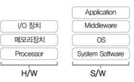 

해당 그림에서 System Software는 Device Driver 혹은 HAL (하드웨어 추상화 계증) 이라고 부릅니다.

### 1.3 OS

(1) RTOS (Real-Time OS)

- 주어진 임의의 작업에 대해 정해진 시간 내에 수행할 수 있도록 하는 환경을 제공
- 개발시에 주로 운영체제와 Task들이 같이 빌드 됩니다.

RTOS에 대해서는 여러가지 정의들이 많이 있지만, 무인 자동차를 운행하는 시스템등에서 전방에 장애물이 나타났을 경우 반드시 부딪히기전에 멈춰서거나 피해가야 합니다. 어떤 상황(부딪히는 상황)에 대해서 정해진 시간(부딪히기 전) 까지는 반드시 응답을 주어야 하는 시스템에서 RTOS 등이 필요하게 됩니다.

(2) Embedded OS

여러 복잡한 작업들을 동시에 효율적으로 수행하기 위한 환경 제공

이미 동작 중에 있는 운영체제 상에서 새로운 프로세스를 이식할 수 있다. -> RTOS에 비해서 Application 개발을 편하게 할 수 있습니다. (IOS, Linux ...)

### Processor

2.1 CPU

(1)

CPU의 구성은 Processor Core + System Bus + Peripherals(H/W IP) + Memory 로 이루어 집니다.

이렇게 CPU 안에 주변장치, Memory 등을 모두 담고 있는 시스템을 SOC 라고 합니다. 

ARM도 Processor Core 중의 한 종류입니다. Data 버스와 Instruction 버스가 따로 있는 것을 보아서 하바드 아키텍쳐 구조입니다.

(2) Processor Core

메모리 장치로 부터 프로그램의 구성 요소인 명령어들을 fetch, decoding, execution 하는 동작을 합니다.

- 레지스터, 연산장치, 제어장치, 버스, 캐시메모리, MMU 등으로 구성됩니다.
- Processor Core 종류에는 ARM, MIPS, intel 등.. 전부 Processor Core의 한 종류입니다.

2.2 RISC and CISC

(1) RISC : 대표 주자는 ARM, MIPS 등이 존재합니다.

모두 같은 32bit의 동일한 명령어 길이를 가지고 있기 때문에 코드의 집적도가 떨어집니다.

이를 보완하기 위해 16bit 코드 사이즈를 가지고 Thumb 명령어를 지원하고 있고, 

cortex-M 계열에서는 ARM, Thu,b 명령어의 장점을 취한 Thumb2 명령어를 사용하고 있습니다.

결국 명령어의 길이가 모두 같기 때문에 코드 집적도는 떨어지지만, 이 덕분에 H/W가 단순해지고 전력 소모를 줄일 수 있습니다. 

또한 명령어의 개수가 많지 않기 때문에 레지스터가 많이 필요합니다.

(Load와 Store Architecture 과정)

 

**2.3 Register**

프로세스 코어에 위치하고 있고, 프로세서가 접근 가능한 가장 빠른 임시 기억장치로 ARM은 아래와 같은 3가지 종류의 레지스터가 존재합니다.

https://computersource.tistory.com/72 ( 참고 )

1. General Purpose Register : 프로그램 데이터 처리에 사용됩니다.
2. Control Register : Stack Pointer, Link Register, Program Counter
   - Stack Pointer는 현재 프로세스 모드의 Stack의 Top 주소를 가르키고 있습니다.
   - Link Register는 서브루틴 분기시 서브부팅을 끝마치고 복귀할 주소를 가지고 있습니다.
   - Program Count는 현재 실행 중인 주소 값입니다.

3. Program Status Register : 프로세서의 상태 정보와 ALU의 결과 정보를 저장하고 있습니다.

일반 레지스터 외에 특별한 레지스터가 있는데 주로 Processor 주위에 있는 주변 장치들을 제어하기 위해서 SFR

(스폐셜 평션 레지스터) 이 것들은 주로 Memory-Mapped 방식으로 접근되고 대부분 bit 단위로 제어가 됩니다.

SFR는 각 레지스터에 해당하는 주소가 정해져 있어서 주소를 통해서 바로 접근이 가능합니다.

S/W 엔니지어가 ARM 펌웨어 프로그램을 한다고 하면 대부분의 작업이 SFR 레지스터를 세팅하고 제어하는 일입니다.

예제로 ARM9 프로세서 중 하나인 삼성의 S3C2440의 UART 제어를 위한 SFR 입니다.

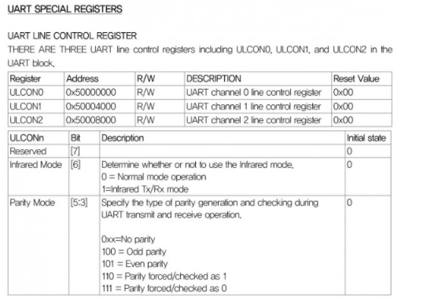 

ULCON0 레지스터의 경우 주소값이 정해져 있습니다. 0x50000000번지의 32비트 레지스터는 각 비트별로 기능이 나누어져 있습니다.  0 ~1 비트는 UART 통신시 WordLength를 설정할 수 있고, 레지스터 별로 각 비트의 기능이 세분화 되어 있습니다!

2.4 ALU

(1) 산술 연산 수행 : ADD, SUB 등 연산 수행

(2) 논리 연산 수행 : AND OR XOR 등 연산 수행

(3) Program Status Register Update : Negative, Zero, Carry, Overflow, Saturation

-> 조건부 명령에 관련이 있어서 ARM Instruction 에서 자세히 설명 하도록 하겠습니다.

2.5 Control Unit ( 인출 -> 명령어 해석 -> 제어 신호를 줌)

1. 메모리에서 명령을 인출합니다.

2. 인출된 명령을 분석하여 어떤 명령인지 어떤 레지스터들이 사용되는지를 확인합니다.

3. 명령어 실행에 필요한 제어신호를 만들어 내고 실행합니다.

   

2.6 Bus

(1) CPU와 메모리 사이의 데이터 통로

(2) CPU : Bus Master, Memory : Bus Slave 두 가지를 중재해주는 bus Arbiter가 존재

Slave가 Master에게 요청하는 것은 불가능. Master만 가능 

(3) Bus : Address 버스(이동하고자 하는 데이터의 주소)와 Data 버스(실제 데이터가 이동)가 존재합니다.

폰 노이만 구조 : CPU와 메모리 사이에는 물리적으로 하나의 버스만 존재합니다. (데이터와 코드에 관한 접근을 하나의 버스로만 합니다.)

하버드 구조 : CPU와 메모리 사이에 두 개 이상의 버스가 존재하여 code와 DATA에 동시에 접근 할 수 있습니다.

2.7 Processor 기본동작

1. 명령어 인출 (Fetch)
   - 명령어를 캐시 혹은 메모리에서 읽어서 명령어 파이프 라인에 저장
2. 명령어 해독 (Decoding)
   - 어떤 일을 하는 명령어 인지 어떤 레지스터를 사용하는지 해독
3. 명령어 실행 (instruction Execution)
   - ALU 연산을 수행해서 - 메모리 접근 명령어인 경우 메모리 접근을 위한 주소 계산
4. 메모리 접근 (Memory Access)
   - ALU 연산에 의해 결정된 주소를 사용하여 메모리에 접근한다.
   - 메모리 접근 명령어가 아닌 경우 결과를 한 사이클 동안 저장

5. 레지스터 쓰기 (Register Write Back)

   - ALU 연산결과를 Register에 기록한다.

   - 메모리에서 읽은 값을 Register에 기록한다.

     

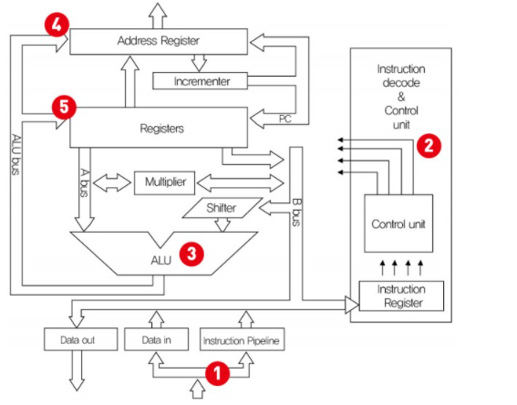 

위 작업을 그림으로 표현하면 다음과 같습니다.

1 . 메모리에서 명령어를 Fetch 하여 명령어 파이프라인에 집어넣습니다. 2. 해당 값을 Control unit에서 해독하고 제어신호를 보내줍니다. 제어신호가 오게 된다면 해당 신호를 보고 3. ALU에서 명령어를 실행하고 결과 값을 내줍니다 결과값은 ALU 버스를 타고 이동합니다.  4. 5 이렇게 이동한 값은 레지스터와 Address Register에 저장됩니다.  2번 과정에서 Instruction Decoder는 명령어를 읽어서 해석하는 일을 하며, Control Unit은 각종 제어신호를 발생시킵니다.

ex) ALU에게 더하기를 하라는 신호를 발생한다던가, 메모리에게 특정 주소를 Read 할 수 있도록 신호를 발생시킨다든가 하는 여러가지 Control 입니다.

3.3 Multi Core Processor

1. Hyper Threading : 하나의 CPU에서 2개 이상의 Thread를 병렬적으로 수행시킵니다. -> 추가적인 레지스터가 필요함

2. Multi core : 하나의 CPU 내부에 두개 이상의 Processor 코어를 두어서 각각의 Processor에서 프로그램을 수행시킵니다. -> 두 가지로 나눠짐

   1. homogeneous :  동일한 똑같은 종류의 CPU를 여러개 가지고 있음
   2. Heterogeneous : 이종혼합 (CPU + GPU)된 CPU들

3. Memory Wall

   코어의 개수가 많을 수록 한 코어가 메모리를 사용할 수 있는 기회가 적어짐

   코어의 개수가 8개 이상 증가되면 메모리 대역폭 성능이 감소된다.

   

## Embedded Software

4.1 언어

​	(1) 기계어 : Processor (CPU)가 이해하는 0과 1로 이루어진 디지털 신호

​		- Processor 제조사마다 코드 방식이 모두 다름

​		- 개발자가 기계어를 사용하는 것은 거의 불가능

​	(2) 어셈블리어

		- 기계어 작성의 불편함을 극복하기 위해서 Processor 제조사에서 정의함
		- 처리속도가 기계어와 같음
		- Processor Core 마다 어셈블리 코드가 다름 
		- 가독성이 기계어보다 좋지만 개발자들에게는 쉽지 않음

​	(3) C 언어

​	Assembly 명령어들의 단점을 극복한 언어

​	임베디드 S/W  개발에 가장 많이 사용됨

4.2 컴파일러

​	(1) C언어 컴파일러 

​		C로 표현된 언어를 어셈블리로 번역하고 오브젝트 파일로 변환시킨다.

​		사용하려는 Processor 코어에 맞는 컴파일러를 사용해야한다.

​		C로 표현된 프로그램을 ARM 코어 CPU에서 동작시키기 위해서는 ARM 컴파일러를 사용 해야 함

​		gcc 혹은 다른 컴파일러들을 사용

​	(2) 오브젝트 파일 -> 컴파일러를 사용한 다음 나타나는 파일 (어셈블리)

​		어셈블리 코드 섹션, 데이터 섹션

​		디버깅 정보

​		심볼 정보 를 담고 있음

4.3 어셈블러

​	어셈블리 언어를 기계어로 변환해주는 녀석입니다. 어셈블리 언어를 사용하여 기계어로 변환시킵니다.

4.4 Linker

​	여러 코드 및 데이터 섹션들에 미리 정의된 주소를 할당합니다.

​	이미 빌드된 라이브러리들이 함께 사용 될 수 있습니다.

​	링크 작업시 같은 속성의 섹션들을 묶어줍니다.

컴파일러, 어셈블러, 링커 등 각각의 하는 일을 살펴보았는데, 컴파일하고 어셈블하고, 링크작업까지 완료가 되면 생성되는 실행가능한 Binary는 어떤 구조로 만들어지는 걸까요

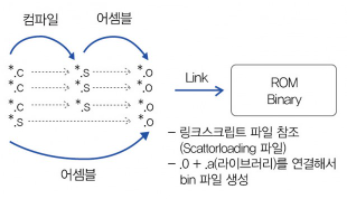 

*.c -> *.s -> *.o -> Link -> ROM Binary

C언어 -> 어셈블리어 -> 기계어 -> 같이 실행되어야 하는 파일들을 묶음(Link) -> 제대로된 Binary 파일

그러면 링커는 여러 개의 *.o 파일을 묶어서 bin 파일을 생성하는 걸까요?

-> 링크 스크립트 파일과 *.o 파일의 구성을 알아야 합니다.

링크 스크립트 파일 : 링커를 돌리기 위해 필요한 필수 파일 (https://embed-avr.tistory.com/86) 참고

일반적인 C 파일이 있다고 한다면 해당 파일은 메모리 상에 3가지 영역으로 구분됩니다.

.data 영역, .bss영역, .text 영역

ZI - bss : 초기화 되지 않은 변수들이 저장된 메모리

RW - data : 초기화 되어 있는 변수들이 저장된 메모리

RO - text : 코드들이 저장되어 있는 메모리 (const 변수도 여기 저장됨)

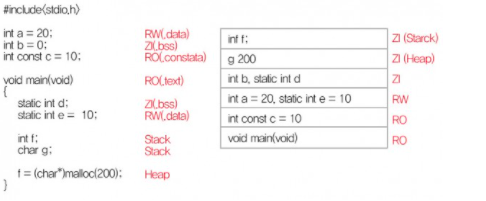 

-> g 200은 오타인 것 같음 f가 Heap임

여기서 중요한 사실은 함수, 전역변수, static 변수는 자기만의 주소를 가지며 Map 파일에 Symbol 형태로 나타납니다. Local 변수는 자기만의 주소를 가지지 못합니다.  해당 함수 내에서만 쓸 수 있는 이유

-> 전역 변수는 본인들만의 고유한 주소를 가지고 있습니다. 다른 파일의 함수 내에서 직접 access가 가능합니다.

왜 bss와 data 영역을 구분할까..?

bss는 [C 표준](http://stackoverflow.com/questions/3532334/how-about-bss-section-not-zero-initialized/3532366#3532366)에서는 나오지 않습니다. 표준에서는 초기화 안 하면 0으로 처리합니다.

그러므로 초기화 해놓지 않은 변수들은 한곳에 모아놓았다가 한번에 0으로 초기화를 해야할 때 알아서 해줍니다.

0인 경우 용량을 차지 하지 않음

## ARM Processor

ARM(영국 회사) system core, architecture core를 License 해주는 IP 회사입니다.

직접 반도체를 제조하여 판매하는 것이 아니라, 설계한 프로세서를 반도체 회사에 일부 수정 가능으로 제공합니다.

ARM 사로 부터 제공받은 ARM core와 주변 장치를 추가하여 SOC를 만들어 사용자에게 판매합니다.

ARM 프로세서의 종류

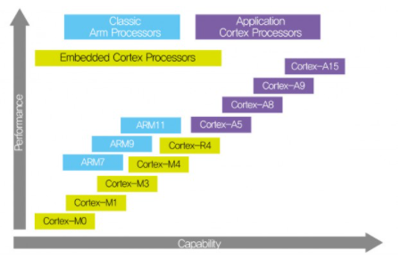 

Cortex 프로세서 이전의 ARM 프로세서들을 전통적인 ARM 프로세서로 분류하였고

Cortex-M, R 시리즈 까지는 기존의 uCOM 시장의 프로세서들을 겨냥한 저가이면서 Realtime 프로세서 시장을 겨냥한 프로세서입니다. A 프로파일부터는 고성능의 Application을 구현하는 프로세서 입니다.

캐시의 구현 방식은 두 가지가 존재합니다.

Write Thought : 캐시의 업데이트와 동시에 메인메모리 업데이트 

Write Back : 캐시에서 나가게 될 때 메인메모리 업데이트 -> 해당 정보를 Write back PA TAG RAM에 저장해둠

-> ARM 프로세서에 설명에 보면 어떤 구조를 사용하는지, 캐쉬 업데이트는 어떻게 하는지, 파이프라이닝의 stage 개수 등이 나와 있음

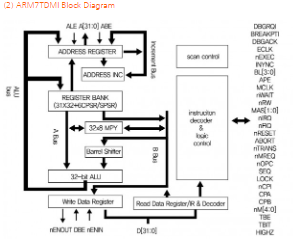 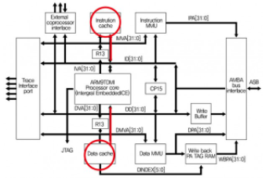 

​					폰 노이만 구조															하버드 구조

### ARM  Processor 선택

현업에서 ARM 프로세서를 선택할 때 가장 큰 기준은 가격대비 성능입니다.

구현하고자 하는 프로젝트를 구현 할 수 있는 가장 낮은 Cost의 프로세서를 선택 할 것이기 때문입니다.

S/W 개발자 입장에서는 개발의 난이도도 상관이 있습니다.

전통적인 ARM에 해당하는 ARM 7,  ARM 9, ARM 11 프로세서들은 RAM, ROM을 CPU 외부에 위치시키기 때문에

( 제품마다 초기화 코드들이 달라짐 ) 코드의 호환성이 떨어지고 부트로더 등을 직접 작성해야 합니다.

이에 반해서 Cortex - M, R 프로파일 코어들은 CPU 내부에 RAM과 ROM을 가지고 있고 Address 또한 같은 코어를 사용하는 CPU들은 모두 동일하게 사용됩니다. 실제로 대부분의 상용 컴파일러들은 개발자가 부트로더 코드를 작성하지 않아도 기본으로 제공하고 있습니다.

ARM based system

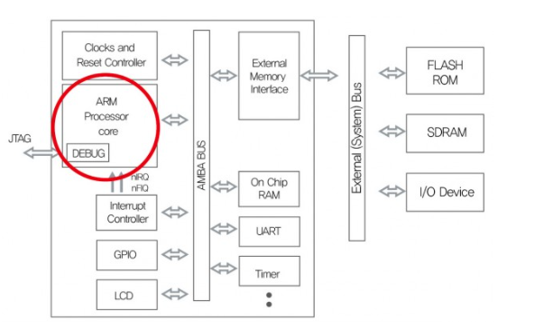 

ARM Core에 대한 블럭도는 아니고, ARM Core를 이용하여 구현한 CPU의 일종임 (UART와 GPIO 등 존재)

6-2 ARM Operating Modes

(1) 7개의 Processor Mode가 존재합니다.

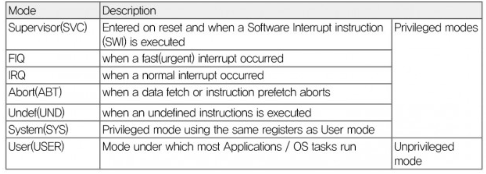   

User, FIQ, IRQ, Supervisor, Abort Mode, Undefined, System Mode

Privileged modes : 특권 모드

Unprivileged modes : 일반 모드

Abort : 데이터 패치가 일어나거나 명령어 프리패치가 중단될 때

FIQ IRQ : 인터럽트가 발생할 때

UND : 정의되지 않은 명령어가 사용되었을 때

ARM 프로세서에 전원이 인가 되면 SVC 모드에서 시작이 되고, 인터럽트, 익셉션 등이 발생하면 하드웨어적으로 실행모드가 변하거나, S/W적으로 SWI 명령어에 의해서 SVC 모드로 진입할 수도 있습니다. ARM Core에는 에 이렇게 여러가지 동작모드가 존재할까...

-> 아키텍쳐 차원에서 소프트웨어의 보안 및 동작을 지원하기 위해서일 것! 가령 OS 설계시 커널 S/W는 모든 권한을 가지고 수행하도록 하고, User 어플리케이션은 제한된 권한을 가지고 수행을 하도록 설계한다면 어플리케이션 프로세서는 모든 권한이 없는 User Mode에서 동작시키고 나머지 커널 및 디바이스 드라이버들은 권한이 있는 나머지 모드에서 실행 시키도록 할 수 있습니다. 

**[CPSR - Current Program Status Register]** -> SFR

현재 status를 저장하는 register

CPSR Register를 Privilege Mode에서 S/W로 변경 가능, User Mode에서 변경하면 Undefined instruction Exception이 발생합니다.

ARM Core에 전원이 인가되면 최초에는 Supervisor 모드로 동작합니다. 처음에 권한이 없는 모드로 시작하면 Privilege Mode로 접근 불가!

각 모드는 Stack영역과 Banked Register 영역을 가지고 있습니다.

많은 모드가 있지만 언제 어떤 모드를 반드시 써야하는 규칙이 있는 것은 아니고 일반적인 권고 사항입니다. OS를 운영하지 않는 단순한 펌웨어 레벨의 코드들은

초기 부팅시 설정된 Supervisor만 사용하는 경우도 많이 있습니다. 

1. Privileged Mode는 IRO나 FIQ등의 인터럽트의 사용 가능 유무를 설정간으합니다.
2. Privileged Mode는 자기들끼리 Mode 변경이 가능하지만, Normal Mode는 스스로 Privileged Mode로 Mode의 변경이 불가능 합니다.

SYS -> FIQ, IRQ -> SVC, 가능

USER -> Provileged Mode 불가능

User Mode는 Application Program을 실행하는 Mode이고, System Mode는 Privileged Operating system task가 실행되는 mode이고,

Supervisor mode는 커널에서 주로 사용되는  mode입니다. 

### ARM Registers

우선 결론 부터 : ARM core는 여러 가지 모드가 있고 mode마다 정해진 레지스터가 쓰인다

일부 레지스터는 공유가 가능하고 각 모드마다 고유한 레지스터가 존재한다.

Normal Registers 

레지스터는 데이터를 임시로 보관하고, 연산에 사용되고, 프로그램 제어에 사용되는 접근속도가 가장 빠른 임시 기억장치라고 설명했습니다.

ARM Core를 잘 이해하기 위해서는 ARM Core에 내장되어 있는 기본 Register들이 어떻게 구성되어 있고, 사용되는지를 알아야 합니다.

Register들은 Core가 사용할 수 있는 저장 매체 중에서 가장 빠른 속도를 자랑하며, ARM의 동작은 모두 Register들을 어떻게 사용하느냐에 따라서 동작을 제어할 수 있습니다. 결국 ARM 프로세서를 사용한다는 것은 Register들을 가지고 연산을 하며 주 메모리와 메모리 매핑된 주변장치들을 제어하기 위해서 Load Store 하는 것 입니다.

LOAD : 메모리에 있는 데이터를 레지스터에 저장시킬 때

STORE : 레지스터에 있는 데이터를 메모리에 저장시킬 때

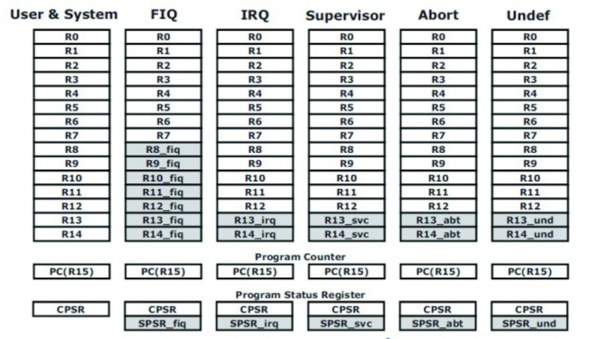 

위의 레지스터 그림을 보면 ARM 동작모드 별로 구분이 되어 있고, 동작 모드에 따라서 파란색 박스로 한번 더 구분이 되어 있는 것을 볼 수 있습니다.

위에서 언급) 각 모드는 Banked Register와 스택영역이 존재한다고 함

파란색 박스로 되어 있는 레지스터들을 뱅크드 레지스터라고 합니다. 흰색 박스의 레지스터는 동작모드에 상관없이 공통으로 사용되어 지고, 파란색 박스의 뱅크드 된 레지스터는 동작 모드 별로 독립적으로 사용 가능하다는 것입니다.

결국 흰색부분은 공통적으로 공유가 가능하고 뱅크드 레지스터는 각 모드에서만 사용하게끔 설계가 되어 있다고 이해하면 됨!!!

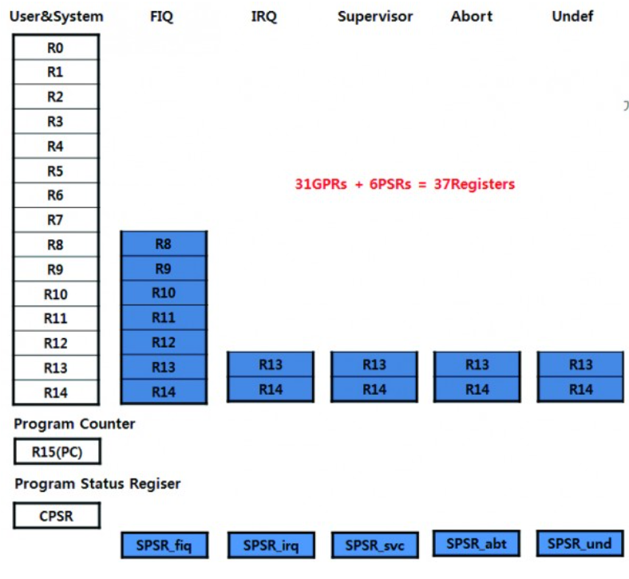 

CPU에 최초 전원이 인가되어 SVC 모드로 동작을 하다가 FIQ 인터럽트가 발생했을 경우 레지스터의 상태!

FIQ로 전환이 되면 R8 ~R14까지는 FIQ 전용 레지스터가 사용됩니다. 이 말은 FIQ모드에서 R8 ~ R14는 SVC 모드에서의 R8~ R 14와는 다른 레지스터 입니다. 

즉 SVC 모드에서 FIQ가 발생되었을 때 Context 보존을 위해서 R8 ~ R14는 저장을 하지 않아도 FIQ모드에서 R8과 R14는 마음대로 사용해도 됩니다.

CPSR 레지스터도 FIQ SVC 모드에서 각각 존재합니다.

http://recipes.egloos.com/4986854 (참고)

문맥이라는 용어에 대한 이해

S/W 입장에서 생각해보면 프로그램이 순서대로 실행이 되다가, 어느 순간에 ISR이 발생을 하면 원래의 프로그램 실행을 잠시 중단하고 ISR 서비스 루틴으로 이동하게 됩니다. 이 때 ISR서비스 루틴으로 이동하는 것을 문맥의 전환이라고 합니다. 인터럽트가 발생시 -> 인터럽트를 처리하고 다시 돌아갈 지정을 위해서...

ISR 서비스 루틴으로 이동하고 나서 ISR 서비스를 마치고 원래의 프로그램이 계속해서 실행이 되어야 하는데, 만약 ISR 서비스 루틴에서 특정 레지스터를 사용했다면 그 값들이 변동이 된 상태에서 원래 프로그램이 실행되던 위치로 돌아와서 실행을 하게 되므로 원치 않는 결과가 나올 수 있습니다. 이러한 이유 때문에 문맥의 보존을 위해서

ISR 서비스 루틴으로 이동을 하기전에 ISR에서 사용될 레지스터들을 스택에 임시로 저장하고 ISR 루틴을 빠져나오기 직전에 스택에 저장되어 있던 레지스터 들을 다시 복원시켜 줍니다.

인터럽트 발생 -> ISR-서비스 루틴 이동하여 사용할 레지스터 값들의 원본 값을 저장해둠  : 문맥의 전환

인터럽트 종료 직전 -> ISR-서비스 루틴에 저장된 레지스터 원본 값을 복원시킴 : 문맥 복귀 

ISR 서비스 루틴으로 이동하는 것을 문맥의 전환이라고 하고

ISR 루틴에서 사용 할 레지스터들을 임시로 스택에 저장하였다가
