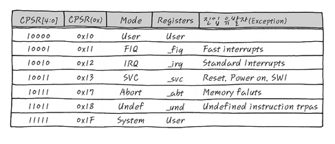
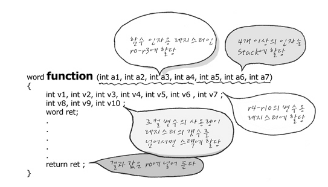

ARM Assembly 기초

RISC - Reduced Instruction Set Compiler ( 명령어 체계가 적음 )

임베디드나 IOT 쪽으로 사용하는 사람이 늘어나고 있음

ARM Architecture의 레지스터는 R0부터 R15까지 존재합니다.

레지스터는 CPU내부에 있는 물리적인 초고속 메모리이고 해당 레지스터를 통해서 빠른 연산이 가능합니다.

 

바이트 단위로 사용이 가능하며

2가지의 모드가 존재합니다. (PC의 업데이트)

ARM - 4-byte instructions

THUMB - 2-byte instructions

Arm Assembly어는 큰 3가지의 틀을 따르고 있습니다. 

operator : 명령어

dst : 목적지

src : 소스

immediate는 숫자를 의미하는 형식으로 작성됩니다.

[ ] -> 해당 레지스터의 메모리 위치

<operator> <dst> <src>

<operator> <dst> <immediate>

<operator> <dst> [address]

ARM Architecture

ARM 구조는 Cortex-M3 , M7, M9가 존재합니다.

ARM의 구조를 이해하는 것을 목표합니다.

임베디드 관련 엔지니어라면 언젠가 한번은 넘어야할 산입니다.

### 임베디드 시스템이란

ARM 프로세서는 예전에는 경량화된 임베디드 시스템에서 사용되었는데, 최근에는 엄청난 성능으로 무장하여 쓰임새가 확대되고 있습니다.

특징

1. 장치에 내장된 Process에 의해 특정한 목적의 기능을 수행하는 하드웨어와 소프트웨어가 조합된 경량화된 시스템입니다.
2. 입출력장치를 내장하고 있다.
3. Processor 동작은 주로 S/W에 의지하여 동작한다.
4. 자동차, 네트워크 장비, Mobile 단말기, 정보가전 등에 응용되고 있다.
5. 저전력, 안정성, 저렴함

임베디드 시스템은 크기 하드웨어와 소프트웨어로 구성되어 있습니다.

(1) 하드웨어

1. CPU , Memory(ROM, RAM, Storage), I/O 장치 : Network LCD GPIO ...

메모리 중에서 NOR와 SDRAM은 Random access가 가능하나 NAND 메모리의 경우는 Random access가 불가능하고 CPU 입장에서 Address 가지고 접근할 수가 없습니다. 따라서 저장장치로 사용합니다.

Address를 가지고 Random access가 가능하다면 XIP(Execute In Place)가 가능하여 부팅을 위한 메모리로서 사용이 가능합니다. CPU의 포트를 사용하여 NAND 메모리에서 부팅이 가능한 것처럼 보여지게 하는 것도 존재합니다.

(2) 소프트웨어

System Software : Firmware(OS 개념이 없음), Device Driver(OS 관점)

RTOS, Embedded OS

Middleware : Network Stack Protocal, File System

Applications

 

해당 그림에서 System Software는 Device Driver 혹은 HAL (하드웨어 추상화 계증) 이라고 부릅니다.

### 1.3 OS

(1) RTOS (Real-Time OS)

- 주어진 임의의 작업에 대해 정해진 시간 내에 수행할 수 있도록 하는 환경을 제공
- 개발시에 주로 운영체제와 Task들이 같이 빌드 됩니다.

RTOS에 대해서는 여러가지 정의들이 많이 있지만, 무인 자동차를 운행하는 시스템등에서 전방에 장애물이 나타났을 경우 반드시 부딪히기전에 멈춰서거나 피해가야 합니다. 어떤 상황(부딪히는 상황)에 대해서 정해진 시간(부딪히기 전) 까지는 반드시 응답을 주어야 하는 시스템에서 RTOS 등이 필요하게 됩니다.

(2) Embedded OS

여러 복잡한 작업들을 동시에 효율적으로 수행하기 위한 환경 제공

이미 동작 중에 있는 운영체제 상에서 새로운 프로세스를 이식할 수 있다. -> RTOS에 비해서 Application 개발을 편하게 할 수 있습니다. (IOS, Linux ...)

### Processor

2.1 CPU

(1)

CPU의 구성은 Processor Core + System Bus + Peripherals(H/W IP) + Memory 로 이루어 집니다.

이렇게 CPU 안에 주변장치, Memory 등을 모두 담고 있는 시스템을 SOC 라고 합니다. 

ARM도 Processor Core 중의 한 종류입니다. Data 버스와 Instruction 버스가 따로 있는 것을 보아서 하바드 아키텍쳐 구조입니다.

(2) Processor Core

메모리 장치로 부터 프로그램의 구성 요소인 명령어들을 fetch, decoding, execution 하는 동작을 합니다.

- 레지스터, 연산장치, 제어장치, 버스, 캐시메모리, MMU 등으로 구성됩니다.
- Processor Core 종류에는 ARM, MIPS, intel 등.. 전부 Processor Core의 한 종류입니다.

2.2 RISC and CISC

(1) RISC : 대표 주자는 ARM, MIPS 등이 존재합니다.

모두 같은 32bit의 동일한 명령어 길이를 가지고 있기 때문에 코드의 집적도가 떨어집니다.

이를 보완하기 위해 16bit 코드 사이즈를 가지고 Thumb 명령어를 지원하고 있고, 

cortex-M 계열에서는 ARM, Thu,b 명령어의 장점을 취한 Thumb2 명령어를 사용하고 있습니다.

결국 명령어의 길이가 모두 같기 때문에 코드 집적도는 떨어지지만, 이 덕분에 H/W가 단순해지고 전력 소모를 줄일 수 있습니다. 

또한 명령어의 개수가 많지 않기 때문에 레지스터가 많이 필요합니다.

(Load와 Store Architecture 과정)

 

**2.3 Register**

프로세스 코어에 위치하고 있고, 프로세서가 접근 가능한 가장 빠른 임시 기억장치로 ARM은 아래와 같은 3가지 종류의 레지스터가 존재합니다.

https://computersource.tistory.com/72 ( 참고 )

1. General Purpose Register : 프로그램 데이터 처리에 사용됩니다.
2. Control Register : Stack Pointer, Link Register, Program Counter
   - Stack Pointer는 현재 프로세스 모드의 Stack의 Top 주소를 가르키고 있습니다.
   - Link Register는 서브루틴 분기시 서브부팅을 끝마치고 복귀할 주소를 가지고 있습니다.
   - Program Count는 현재 실행 중인 주소 값입니다.

3. Program Status Register : 프로세서의 상태 정보와 ALU의 결과 정보를 저장하고 있습니다.

일반 레지스터 외에 특별한 레지스터가 있는데 주로 Processor 주위에 있는 주변 장치들을 제어하기 위해서 SFR

(스폐셜 평션 레지스터) 이 것들은 주로 Memory-Mapped 방식으로 접근되고 대부분 bit 단위로 제어가 됩니다.

SFR는 각 레지스터에 해당하는 주소가 정해져 있어서 주소를 통해서 바로 접근이 가능합니다.

S/W 엔니지어가 ARM 펌웨어 프로그램을 한다고 하면 대부분의 작업이 SFR 레지스터를 세팅하고 제어하는 일입니다.

예제로 ARM9 프로세서 중 하나인 삼성의 S3C2440의 UART 제어를 위한 SFR 입니다.

 

ULCON0 레지스터의 경우 주소값이 정해져 있습니다. 0x50000000번지의 32비트 레지스터는 각 비트별로 기능이 나누어져 있습니다.  0 ~1 비트는 UART 통신시 WordLength를 설정할 수 있고, 레지스터 별로 각 비트의 기능이 세분화 되어 있습니다!

2.4 ALU

(1) 산술 연산 수행 : ADD, SUB 등 연산 수행

(2) 논리 연산 수행 : AND OR XOR 등 연산 수행

(3) Program Status Register Update : Negative, Zero, Carry, Overflow, Saturation

-> 조건부 명령에 관련이 있어서 ARM Instruction 에서 자세히 설명 하도록 하겠습니다.

2.5 Control Unit ( 인출 -> 명령어 해석 -> 제어 신호를 줌)

1. 메모리에서 명령을 인출합니다.

2. 인출된 명령을 분석하여 어떤 명령인지 어떤 레지스터들이 사용되는지를 확인합니다.

3. 명령어 실행에 필요한 제어신호를 만들어 내고 실행합니다.

   

2.6 Bus

(1) CPU와 메모리 사이의 데이터 통로

(2) CPU : Bus Master, Memory : Bus Slave 두 가지를 중재해주는 bus Arbiter가 존재

Slave가 Master에게 요청하는 것은 불가능. Master만 가능 

(3) Bus : Address 버스(이동하고자 하는 데이터의 주소)와 Data 버스(실제 데이터가 이동)가 존재합니다.

폰 노이만 구조 : CPU와 메모리 사이에는 물리적으로 하나의 버스만 존재합니다. (데이터와 코드에 관한 접근을 하나의 버스로만 합니다.)

하버드 구조 : CPU와 메모리 사이에 두 개 이상의 버스가 존재하여 code와 DATA에 동시에 접근 할 수 있습니다.

2.7 Processor 기본동작

1. 명령어 인출 (Fetch)
   - 명령어를 캐시 혹은 메모리에서 읽어서 명령어 파이프 라인에 저장
2. 명령어 해독 (Decoding)
   - 어떤 일을 하는 명령어 인지 어떤 레지스터를 사용하는지 해독
3. 명령어 실행 (instruction Execution)
   - ALU 연산을 수행해서 - 메모리 접근 명령어인 경우 메모리 접근을 위한 주소 계산
4. 메모리 접근 (Memory Access)
   - ALU 연산에 의해 결정된 주소를 사용하여 메모리에 접근한다.
   - 메모리 접근 명령어가 아닌 경우 결과를 한 사이클 동안 저장

5. 레지스터 쓰기 (Register Write Back)

   - ALU 연산결과를 Register에 기록한다.

   - 메모리에서 읽은 값을 Register에 기록한다.

     

 

위 작업을 그림으로 표현하면 다음과 같습니다.

1 . 메모리에서 명령어를 Fetch 하여 명령어 파이프라인에 집어넣습니다. 2. 해당 값을 Control unit에서 해독하고 제어신호를 보내줍니다. 제어신호가 오게 된다면 해당 신호를 보고 3. ALU에서 명령어를 실행하고 결과 값을 내줍니다 결과값은 ALU 버스를 타고 이동합니다.  4. 5 이렇게 이동한 값은 레지스터와 Address Register에 저장됩니다.  2번 과정에서 Instruction Decoder는 명령어를 읽어서 해석하는 일을 하며, Control Unit은 각종 제어신호를 발생시킵니다.

ex) ALU에게 더하기를 하라는 신호를 발생한다던가, 메모리에게 특정 주소를 Read 할 수 있도록 신호를 발생시킨다든가 하는 여러가지 Control 입니다.

3.3 Multi Core Processor

1. Hyper Threading : 하나의 CPU에서 2개 이상의 Thread를 병렬적으로 수행시킵니다. -> 추가적인 레지스터가 필요함

2. Multi core : 하나의 CPU 내부에 두개 이상의 Processor 코어를 두어서 각각의 Processor에서 프로그램을 수행시킵니다. -> 두 가지로 나눠짐

   1. homogeneous :  동일한 똑같은 종류의 CPU를 여러개 가지고 있음
   2. Heterogeneous : 이종혼합 (CPU + GPU)된 CPU들

3. Memory Wall

   코어의 개수가 많을 수록 한 코어가 메모리를 사용할 수 있는 기회가 적어짐

   코어의 개수가 8개 이상 증가되면 메모리 대역폭 성능이 감소된다.

   

## Embedded Software

4.1 언어

​	(1) 기계어 : Processor (CPU)가 이해하는 0과 1로 이루어진 디지털 신호

​		- Processor 제조사마다 코드 방식이 모두 다름

​		- 개발자가 기계어를 사용하는 것은 거의 불가능

​	(2) 어셈블리어

		- 기계어 작성의 불편함을 극복하기 위해서 Processor 제조사에서 정의함
		- 처리속도가 기계어와 같음
		- Processor Core 마다 어셈블리 코드가 다름 
		- 가독성이 기계어보다 좋지만 개발자들에게는 쉽지 않음

​	(3) C 언어

​	Assembly 명령어들의 단점을 극복한 언어

​	임베디드 S/W  개발에 가장 많이 사용됨

4.2 컴파일러

​	(1) C언어 컴파일러 

​		C로 표현된 언어를 어셈블리로 번역하고 오브젝트 파일로 변환시킨다.

​		사용하려는 Processor 코어에 맞는 컴파일러를 사용해야한다.

​		C로 표현된 프로그램을 ARM 코어 CPU에서 동작시키기 위해서는 ARM 컴파일러를 사용 해야 함

​		gcc 혹은 다른 컴파일러들을 사용

​	(2) 오브젝트 파일 -> 컴파일러를 사용한 다음 나타나는 파일 (어셈블리)

​		어셈블리 코드 섹션, 데이터 섹션

​		디버깅 정보

​		심볼 정보 를 담고 있음

4.3 어셈블러

​	어셈블리 언어를 기계어로 변환해주는 녀석입니다. 어셈블리 언어를 사용하여 기계어로 변환시킵니다.

4.4 Linker

​	여러 코드 및 데이터 섹션들에 미리 정의된 주소를 할당합니다.

​	이미 빌드된 라이브러리들이 함께 사용 될 수 있습니다.

​	링크 작업시 같은 속성의 섹션들을 묶어줍니다.

컴파일러, 어셈블러, 링커 등 각각의 하는 일을 살펴보았는데, 컴파일하고 어셈블하고, 링크작업까지 완료가 되면 생성되는 실행가능한 Binary는 어떤 구조로 만들어지는 걸까요

 

*.c -> *.s -> *.o -> Link -> ROM Binary

C언어 -> 어셈블리어 -> 기계어 -> 같이 실행되어야 하는 파일들을 묶음(Link) -> 제대로된 Binary 파일

그러면 링커는 여러 개의 *.o 파일을 묶어서 bin 파일을 생성하는 걸까요?

-> 링크 스크립트 파일과 *.o 파일의 구성을 알아야 합니다.

링크 스크립트 파일 : 링커를 돌리기 위해 필요한 필수 파일 (https://embed-avr.tistory.com/86) 참고

일반적인 C 파일이 있다고 한다면 해당 파일은 메모리 상에 3가지 영역으로 구분됩니다.

.data 영역, .bss영역, .text 영역

ZI - bss : 초기화 되지 않은 변수들이 저장된 메모리

RW - data : 초기화 되어 있는 변수들이 저장된 메모리

RO - text : 코드들이 저장되어 있는 메모리 (const 변수도 여기 저장됨)

 

-> g 200은 오타인 것 같음 f가 Heap임

여기서 중요한 사실은 함수, 전역변수, static 변수는 자기만의 주소를 가지며 Map 파일에 Symbol 형태로 나타납니다. Local 변수는 자기만의 주소를 가지지 못합니다.  해당 함수 내에서만 쓸 수 있는 이유

-> 전역 변수는 본인들만의 고유한 주소를 가지고 있습니다. 다른 파일의 함수 내에서 직접 access가 가능합니다.

왜 bss와 data 영역을 구분할까..?

bss는 [C 표준](http://stackoverflow.com/questions/3532334/how-about-bss-section-not-zero-initialized/3532366#3532366)에서는 나오지 않습니다. 표준에서는 초기화 안 하면 0으로 처리합니다.

그러므로 초기화 해놓지 않은 변수들은 한곳에 모아놓았다가 한번에 0으로 초기화를 해야할 때 알아서 해줍니다.

0인 경우 용량을 차지 하지 않음

## ARM Processor

ARM(영국 회사) system core, architecture core를 License 해주는 IP 회사입니다.

직접 반도체를 제조하여 판매하는 것이 아니라, 설계한 프로세서를 반도체 회사에 일부 수정 가능으로 제공합니다.

ARM 사로 부터 제공받은 ARM core와 주변 장치를 추가하여 SOC를 만들어 사용자에게 판매합니다.

ARM 프로세서의 종류

 

Cortex 프로세서 이전의 ARM 프로세서들을 전통적인 ARM 프로세서로 분류하였고

Cortex-M, R 시리즈 까지는 기존의 uCOM 시장의 프로세서들을 겨냥한 저가이면서 Realtime 프로세서 시장을 겨냥한 프로세서입니다. A 프로파일부터는 고성능의 Application을 구현하는 프로세서 입니다.

캐시의 구현 방식은 두 가지가 존재합니다.

Write Thought : 캐시의 업데이트와 동시에 메인메모리 업데이트 

Write Back : 캐시에서 나가게 될 때 메인메모리 업데이트 -> 해당 정보를 Write back PA TAG RAM에 저장해둠

-> ARM 프로세서에 설명에 보면 어떤 구조를 사용하는지, 캐쉬 업데이트는 어떻게 하는지, 파이프라이닝의 stage 개수 등이 나와 있음

  

​					폰 노이만 구조															하버드 구조

### ARM  Processor 선택

현업에서 ARM 프로세서를 선택할 때 가장 큰 기준은 가격대비 성능입니다.

구현하고자 하는 프로젝트를 구현 할 수 있는 가장 낮은 Cost의 프로세서를 선택 할 것이기 때문입니다.

S/W 개발자 입장에서는 개발의 난이도도 상관이 있습니다.

전통적인 ARM에 해당하는 ARM 7,  ARM 9, ARM 11 프로세서들은 RAM, ROM을 CPU 외부에 위치시키기 때문에

( 제품마다 초기화 코드들이 달라짐 ) 코드의 호환성이 떨어지고 부트로더 등을 직접 작성해야 합니다.

이에 반해서 Cortex - M, R 프로파일 코어들은 CPU 내부에 RAM과 ROM을 가지고 있고 Address 또한 같은 코어를 사용하는 CPU들은 모두 동일하게 사용됩니다. 실제로 대부분의 상용 컴파일러들은 개발자가 부트로더 코드를 작성하지 않아도 기본으로 제공하고 있습니다.

ARM based system

 

ARM Core에 대한 블럭도는 아니고, ARM Core를 이용하여 구현한 CPU의 일종임 (UART와 GPIO 등 존재)

6-2 ARM Operating Modes

(1) 7개의 Processor Mode가 존재합니다.

   

User, FIQ, IRQ, Supervisor, Abort Mode, Undefined, System Mode

Privileged modes : 특권 모드

Unprivileged modes : 일반 모드

Abort : 데이터 패치가 일어나거나 명령어 프리패치가 중단될 때

FIQ IRQ : 인터럽트가 발생할 때

UND : 정의되지 않은 명령어가 사용되었을 때

ARM 프로세서에 전원이 인가 되면 SVC 모드에서 시작이 되고, 인터럽트, 익셉션 등이 발생하면 하드웨어적으로 실행모드가 변하거나, S/W적으로 SWI 명령어에 의해서 SVC 모드로 진입할 수도 있습니다. ARM Core에는 에 이렇게 여러가지 동작모드가 존재할까...

-> 아키텍쳐 차원에서 소프트웨어의 보안 및 동작을 지원하기 위해서일 것! 가령 OS 설계시 커널 S/W는 모든 권한을 가지고 수행하도록 하고, User 어플리케이션은 제한된 권한을 가지고 수행을 하도록 설계한다면 어플리케이션 프로세서는 모든 권한이 없는 User Mode에서 동작시키고 나머지 커널 및 디바이스 드라이버들은 권한이 있는 나머지 모드에서 실행 시키도록 할 수 있습니다. 

**[CPSR - Current Program Status Register]** -> SFR

현재 status를 저장하는 register

CPSR Register를 Privilege Mode에서 S/W로 변경 가능, User Mode에서 변경하면 Undefined instruction Exception이 발생합니다.

ARM Core에 전원이 인가되면 최초에는 Supervisor 모드로 동작합니다. 처음에 권한이 없는 모드로 시작하면 Privilege Mode로 접근 불가!

각 모드는 Stack영역과 Banked Register 영역을 가지고 있습니다.

많은 모드가 있지만 언제 어떤 모드를 반드시 써야하는 규칙이 있는 것은 아니고 일반적인 권고 사항입니다. OS를 운영하지 않는 단순한 펌웨어 레벨의 코드들은

초기 부팅시 설정된 Supervisor만 사용하는 경우도 많이 있습니다. 

1. Privileged Mode는 IRO나 FIQ등의 인터럽트의 사용 가능 유무를 설정간으합니다.
2. Privileged Mode는 자기들끼리 Mode 변경이 가능하지만, Normal Mode는 스스로 Privileged Mode로 Mode의 변경이 불가능 합니다.

SYS -> FIQ, IRQ -> SVC, 가능

USER -> Provileged Mode 불가능

User Mode는 Application Program을 실행하는 Mode이고, System Mode는 Privileged Operating system task가 실행되는 mode이고,

Supervisor mode는 커널에서 주로 사용되는  mode입니다. 

### ARM Registers

우선 결론 부터 : ARM core는 여러 가지 모드가 있고 mode마다 정해진 레지스터가 쓰인다

일부 레지스터는 공유가 가능하고 각 모드마다 고유한 레지스터가 존재한다.

Normal Registers 

레지스터는 데이터를 임시로 보관하고, 연산에 사용되고, 프로그램 제어에 사용되는 접근속도가 가장 빠른 임시 기억장치라고 설명했습니다.

ARM Core를 잘 이해하기 위해서는 ARM Core에 내장되어 있는 기본 Register들이 어떻게 구성되어 있고, 사용되는지를 알아야 합니다.

Register들은 Core가 사용할 수 있는 저장 매체 중에서 가장 빠른 속도를 자랑하며, ARM의 동작은 모두 Register들을 어떻게 사용하느냐에 따라서 동작을 제어할 수 있습니다. 결국 ARM 프로세서를 사용한다는 것은 Register들을 가지고 연산을 하며 주 메모리와 메모리 매핑된 주변장치들을 제어하기 위해서 Load Store 하는 것 입니다.

LOAD : 메모리에 있는 데이터를 레지스터에 저장시킬 때

STORE : 레지스터에 있는 데이터를 메모리에 저장시킬 때

 

위의 레지스터 그림을 보면 ARM 동작모드 별로 구분이 되어 있고, 동작 모드에 따라서 파란색 박스로 한번 더 구분이 되어 있는 것을 볼 수 있습니다.

위에서 언급) 각 모드는 Banked Register와 스택영역이 존재한다고 함

파란색 박스로 되어 있는 레지스터들을 뱅크드 레지스터라고 합니다. 흰색 박스의 레지스터는 동작모드에 상관없이 공통으로 사용되어 지고, 파란색 박스의 뱅크드 된 레지스터는 동작 모드 별로 독립적으로 사용 가능하다는 것입니다.

결국 흰색부분은 공통적으로 공유가 가능하고 뱅크드 레지스터는 각 모드에서만 사용하게끔 설계가 되어 있다고 이해하면 됨!!!

 

CPU에 최초 전원이 인가되어 SVC 모드로 동작을 하다가 FIQ 인터럽트가 발생했을 경우 레지스터의 상태!

FIQ로 전환이 되면 R8 ~R14까지는 FIQ 전용 레지스터가 사용됩니다. 이 말은 FIQ모드에서 R8 ~ R14는 SVC 모드에서의 R8~ R 14와는 다른 레지스터 입니다. 

즉 SVC 모드에서 FIQ가 발생되었을 때 Context 보존을 위해서 R8 ~ R14는 저장을 하지 않아도 FIQ모드에서 R8과 R14는 마음대로 사용해도 됩니다.

CPSR 레지스터도 FIQ SVC 모드에서 각각 존재합니다.

http://recipes.egloos.com/4986854 (참고)

문맥이라는 용어에 대한 이해

S/W 입장에서 생각해보면 프로그램이 순서대로 실행이 되다가, 어느 순간에 ISR이 발생을 하면 원래의 프로그램 실행을 잠시 중단하고 ISR 서비스 루틴으로 이동하게 됩니다. 이 때 ISR서비스 루틴으로 이동하는 것을 문맥의 전환이라고 합니다. 인터럽트가 발생시 -> 인터럽트를 처리하고 다시 돌아갈 지정을 위해서...

ISR 서비스 루틴으로 이동하고 나서 ISR 서비스를 마치고 원래의 프로그램이 계속해서 실행이 되어야 하는데, 만약 ISR 서비스 루틴에서 특정 레지스터를 사용했다면 그 값들이 변동이 된 상태에서 원래 프로그램이 실행되던 위치로 돌아와서 실행을 하게 되므로 원치 않는 결과가 나올 수 있습니다. 이러한 이유 때문에 문맥의 보존을 위해서

ISR 서비스 루틴으로 이동을 하기전에 ISR에서 사용될 레지스터들을 스택에 임시로 저장하고 ISR 루틴을 빠져나오기 직전에 스택에 저장되어 있던 레지스터 들을 다시 복원시켜 줍니다.

인터럽트 발생 -> ISR-서비스 루틴 이동하여 사용할 레지스터 값들의 원본 값을 저장해둠  : 문맥의 전환

인터럽트 종료 직전 -> ISR-서비스 루틴에 저장된 레지스터 원본 값을 복원시킴 : 문맥 복귀 

ISR 서비스 루틴으로 이동하는 것을 문맥의 전환이라고 하고

ISR 루틴에서 사용 할 레지스터들을 임시로 스택에 저장하였다가 ISR 루틴의 수행을 마치고 복귀하기 전에 

저장해놓았던 레지스터들을 원래의 값으로 복원하는 것을 문백 보존이라고 합니다.

CPU에는 여러가지 레지스터들이 존재하는데 -> 인터럽트가 발생하면 레지스터들이 사용된다.

-> 한정된 레지스터를 가지고 인터럽트를 사용해야 하므로 레지스터들은 공유상태

즉 인터럽트가 발생했을 때 레지스터들이 사용될 수 있는 것을 원래대로 돌리는 것을 말합니다.

 

아래 그림으로 표현이 가능합니다. 

스택을 사용해서 ISR 서비스 루틴에서 문맥 저장과 복원을 하고 있어 인터럽트가 발생하여

문맥전환이 이뤄졌음에도 불구하고 복귀하였을 때 R2에는 정상적으로값이 들어가게 됩니다.

FIQ 인터럽트가 발생했을 때의 경우를 보겠습니다.

 

ISR 인터럽트가 발생했을 때는 공유된 레지스터들이 사용되어서 문맥을 교환시켰는데, 지금은 뱅크드된 레지스터들을 사용하기 때문에 인터럽트가 발생했을 때 문맥교환이 이루어지지 않습니다. 

만약 FIQ 모드에서도 R0 ~ R7를 사용한다면 문맥 저장과 복원을 해야합니다.

-> 매우 중요한 경우이니 꼭 암기!!

정리 : 

1. 일반적인 레지스터를 사용하는 인터럽트의 경우는 문맥 보존

2. 뱅크드된 레지스터를 사용하는 인터럽트의 경우는 문맥 보존을 하지 않는다. (개별이기 때문)

# 

System mode와 User mode는 똑같은 register set을 사용합니다.

두가지 모드는 R0 ~ R15, CPSR을 모두 같이 사용하며 구분하는 딱 하나의 차이는 CPSR mode bit 값만 차이 납니다. 여기서 주목할 점은 System mode는 SPSR이 없느냐 하는 문제인데 이를 잘 생각해야 합니다.

이제 CPSR이라는 녀석의 정체를 살펴봐야 합니다. 도대체 CPSR 이라는 녀석은 누구냐!

CPSR은 특별한 레지스터 입니다. 이러한 특별한 레지스터의 종류는 CPSR, SPSR, R15(PC), R14(LR), R13(SP)가

있습니다.

CPSR은 Current Program Status Register가 정체이며 크기가 레지스터의 크기가 32비트이므로 이를 표현하면

 이렇게 생겼습니다. -> 각 비트들은 필요한 만큼 어떠한 역할을 수행하게 되는데 세부적으로 또 NZCV, unused, IF T mode가 나뉘게 됩니다.

NZCV는 Flag field라고 해서 연산한 후에 set되는 레지스터 입니다. -> 방금 처리된 연산 결과의 상태를 나타냅니다. 31, 30, 29, 28 이렇게 각각의 의미하는 바를 N,Z,C,V라는 하나의 비트에 넣은 것입니다.

(1)  N : Negative : 연산결과가 마이너스인 경우에 1로 표현됩니다.

(2) Z : Zero : 연산 결과가 0인 경우에 1로 표현됩니다.

(3) C : Carry : 연산결과에 자리 올림이 발생한 경우 1로 표현됩니다.

(4) V : Overflow : 연산의 결과가 overflow 났을 경우 1로 표현됩니다.

-> Overflow의 경우는 표현하고자 하는 비트가 넘쳐서 연산결과를 표현못하는 경우를 뜻합니다.

결국 결과 값을 표현해주는 것에 도움을 주는데 왜 필요할까? 를 고민해야합니다.

4가지의 필요성은 ARM의 철학을 나타냅니다. ARM Assembly section에서 다루기는 하겠지만

ARM core는 Opcode를 Memory에서 가져오자 마자 (Fetch) 이를 실행하는 것이 아니라 

-> (MIPS는 바로 실행이였던 것 같음 )

condition flag인 NZCV를 보고 바로 앞 opcode의 실행결과 보고 실행할지 말지를 결정합니다.

IF : IRQ나 FIQ가 (인터럽트) 걸릴 수 있는지에 관련한 field입니다.

7번째 bit는 IRO, 6번째 bit는 FIQ가 걸릴 수 있는지에 관련한 field이다.  해당 비트를

1로 처리하면 해당 모드 진행 중에 인터럽트가 Enable한지 Disable한지 정할 수 있습니다.

5번째 T는 Thumb mode이냐 ARM mode이냐를 나타내는 field입니다. Thumb mode는 하위 16비트로 명령어를 지정할 수 있는 모드인데 나중에 자세하게 언급합니다!

0 ~ 4의 5개의 비트는 현재 mode를 나타냅니다. -> 현재 모드가 SVC인지, UND인지 ABT 인지 등을 나타내며 

register가 현재 CPU의 상태를 나타내는 아주 중요한 register입니다!

결론 : CPSR의 값은 현재의 mode도 확인 가능한 register입니다.

하위 5비트 (0~4)를 원하는 mode로 세팅하면 그 모드로 전환도 됩니다.

System mode와 User mode는 이 CPSR의 mode bit만 차이가 나고  나머지가 동일하고 같이 사용합니다.

이제 SPSR을 알아봅시다!

Saved Program Status Register입니다.

SPSR은 말 그대로 CPSR을 복사해서 넣는 특수 Register입니다. -> CPSR을 backup 할 때 써먹습니다.

백업?!은 언제 진행이 되느냐 : SPSR에 CPSR의 값을 백업해놓고 mode를 바꾸게 되었을 때 SPSR의 값을 다시 CPSR에 집어 넣으면 이전 mode의 상태로 바로 복귀 가능합니다!!!!!!!

그래서 CPSR은 하나면 충분하고 SPSR은 각 모드마다 하나씩 필요합니다.

R14 (LR) : Linked Register : ARM은 어딘가로 branch (jump) 할 때 어디서 branch 해 왔는지 표시해줍니다.

branch(jump)는 다른 위치로 이동하는 명령어라고 생각하면 됩니다. -> 그러면 해당 작업이 끝나면 다시 돌아가야 하는데... 돌아갈 위치를 기록해놔야지 돌아갈 수 있습니다! -> R14번에 돌아갈 위치를 기록해놓습니다.

R13(Stack Pointer) : 현재 Stack을 어디까지 쌓아 두었는지 가르쳐 줍니다. 결국 해당 스택 포인터를 통해서 함수가 제대로 돌아갈 수 있게되는 것입니다.

R15(PC) : 현재 어디를 수행하고 있는 건지 나타내주는 레지스터 입니다. 현재 수행하고 있는 위치는 단 하나이므로 1개만 존재합니다. 현재 명령어를 Fetch해온 위치를 가리키고 있습니다.

메모 : 실행하는 위치가 아니라 -> 명령어를 가져온. 즉 Fetch를 해온 위치를 가르키는 거다 입니다.

R0~R12까지는 CPU의 동작 중에 저장용도로 적절히 사용되는 것 입니다. 그래서 R0부터 R12까지는 그냥 레지스터라고 부르고, R13~R15. CPSR, SPSR은 특별한 용도가 있다고 해서, Special Purpose Register라고 까지합니다!

Context Switching 스냅샷이라고도 표현한다.

현재 레지스터의 상태(PC도 포함)를 그대로 저장해놓고 인터럽트가 발생했을 때 이동한다면 다시 복원을 할 수 있습니다.

-> 스냅샷 데이터는 어디에 저장이 되는가!!!!!!!가 궁금

왜 FIQ 는 banked register가 남들보다 많을까요?

뱅크드 레지스터들을 많이 두는게 문맥교환이 일어날 확률도 적고, 공유 자원을 최대한 덜 전환하면 좋으니까

전용 레지스터를 더 둔 것!!

ARM Mode과 Register들을 알아보았으니, Mode에 진입하는 방법에 대해서 말씀드리겠습니다!!

Privileged Mode는 자기 마음대로 mode를 바꿀 수 있지만, 

그거 이외에 Hardware적으로 자동으로 특정 Mode에 진입할 수가 있습니다.

-> 인터럽트가 발생하면 SVC Mode에서 인터럽트 모드로 들어가서 작업을 수행하는게 아니라 자동으로!!

이렇게 자동으로 할 수 있는 매개체가 !!Exception입니다. 

즉 Exception이라고 하는 것은 인터럽트를 포함한 더 큰 사건을 의미합니다. -> 외부 요청이라던가 오류에 관련된 것입니다. ( 인터럽트는 Exception에 한 종류!!!! )

Exception이라는 사건을 통해서 Hardware적으로 정해진 특별한 reaction이 발생합니다.

그 reaction이라는 것은 Exception이 발생하면 진행하던 동작을 멈추고, Exception의 종류에 해당하는 모드에 진입하고 그 Exception에 물려 있는 해당 주소로 pc를 jump 시킨 후 Exception에 대한 처리를 합니다.

좀 더 자세하게 들어가면, 처음에 CPU를 실행할 때 리셋벡터로 0x0000주소로 메모리를 위치시키는데, 이것을  글로 표현하면 다음과 같습니다!

SVC mode는 ARM에 전원을 인가하거나, reset을 시키면 SVC mode로 진입하면서, PC를 0x0으로 jump 시킵니다. 

IRQ나 FIQ mode는 인터럽트가 발생하면, IRQ 혹은 FIQ mode로 진입하면서 PC를 0x1C 혹은 0x18로 jump시킵니다. 

ABORT mode의 경우에도, data abort가 난 경우에는 0x10으로 Prefetch abort의 경우에는 0x0C로 hump를 하고 ABT mode로 진입합니다.

UNDEF mode의 경우도 Undef execption이 났을 경우 UNDEF mode로 진입하면서 PC를 0x04로 jump 시킵니다.

여기서 PC를 어딘가로 jump시킨다는 이야기는 PC값에 해당 메모리값으로 setting한다는 이야기이고, setting을 하면 거기서부터 Software를 실행한다고 보면 되겠습니다!!!!

 

이러한 Exception이 일어났을 때 jump하는 Address들을 모아 Exception Vectior table이라고 부릅니다.

-> 각 예외에 해당하는 메모리 주소는 정해져 있습니다! 무언가 예외상황이 발생하면 PC를 해당 Vector의 주소로 이동시켜서 모드를 설정합니다.

다시 말해 Exception이 발생하면 그 Exception에 해당하는 미리 정해진 memory Address에 저장된 프로그램을 하드웨어적으로 수행하는데 이 address를 Exception Vector라고 하고, 각각의 Exception에 대해서 Exception Vector를 정의해 놓은 테이블을 Exception Vector Table이라고 합니다!!!!!

여기서 재미있는 case는 user mode와 system mode로 진입하는 Exception은 없다는 것입니다. 

예외가 발생해서 user mode로 이동하게 되면 ... 다른 예외가 나올 때까지 해당 모드에서 빠져나올 방법이 없기 때문..... ㅠㅠ

Low vector와 High vector는 무엇일까 !!

Low Vector는 말 그대로 Low Address에 Vector Table이 존재하는 방식이고, High Vector는 높은 주소에 Vector Table이 존재하는 방식으로서, 보통 MCP를 처음 디자인할 때 어떤 것을 쓸지 정해놓습니다.

원래는 Low Vector를 사용하지만 최근에 NAND Flash에 Software를 넣어두고 실행 할 때 SDRAM에 NAND의 내용을 복사한 후 실행하는 방식이 늘어나다 보니, SDRAM을 init하기전에는 해당 부분을 사용할 수 없으므로,

아주 작은 크기에 SRAM을 부트로더로 MCP 내부에 넣어두고 그 영역의 주소를 High Vector로 사용하는 경우가 생김!!

 

그림으로 표현되었는데 참 귀엽네요. -> user mode는 왕따...

자 이제 각각의 Exception들은 어떨 때 발생하는지 생각해봅시다!!!!!

1. SVC mode : Power on이나 reset이 일어난 경우 SVC mode에 진입합니다
2. IRQ mode : Hardware적인 인터럽트가 발생하여 ARM에 Core에 알려주면 IRQ mode로 진입합니다.
3. FIQ mode : Fast interrupt가 발생하면 진입합니다.
4. ABT mode : Abort mode는 접근하려고 하는 메모리 주소가 접근 할 수 없는 주소이거나 명령어 패치가 실패한 경우 진입됩니다. Access Protection이 걸려 있는 주소를 함부로 접근하려고 했을 때도 발생합니다.
5. UND mode : Undefined mode는 Instruction을 해석했는데 ARM이 모르는 것일 경우에 진입하게 되며, 보통 memory Corruption이 났을 때, 발생합니다만, 이걸 응용하게 되면, ARM이 사용하지 않는 코드를 일부러 삽입해서 해당 부분에서 멈추게 하여 디버깅을 하는 등 의도된 일을 할 수 있습니다.

ARM을 다루는데 있어서 가장 기초적인 내용이므로 !!! 열심히 외우기

 

해당 표를 유심히 보기!!

CPSR의 Hex값과  Mode를 매칭해서 외우면 엄청 편리함.

Exception에도 우선순위가 존재함

한꺼번에 Exception이 발생했을 때 어느 것이 처리되느냐가 문제입니다.

우선순위는 System이 맛탱이? 가게하는 순 중요도... ㅎㅎ 순서로 순위를 매깁니다.

1등은 Reset : 가장 강합니다.

2등은 Data Abort : Data를 못 읽어오면 소용이 없음

3등은 FIQ 이고 4등은 IRQ

5위는 Prefetch Abort입니다. -> Prefetch Abort는 Pipe line중 가장 처음인 fetch단계에서

발생하니까 굳이 순위를 높여 놓지 않아도 항상 먼저 발생합니다.

6위는 Undefined instruction입니다. -> 명령어 해석을 못하는 경우

7위는 SWI : SWI는 프로그래머가 일부러 의도적으로 발생시키는 것이므로 굳이

예외 순위가 높지 않아도 됩니다.

소프트웨어 실행중 Exception이 발생하면 어떤 일이 벌어지느냐

고려해야 하는 것들은

1. Exception  mode가 발생 한 후 이전 mode로 돌아갈 수 있어야 합니다.
2. 문맥 교환이 잘 이뤄져야 합니다. -> 전에 쓰던 레지스터들 원상복구
3. 이전 모드로 돌아갔을 때 중지한 부분에서 다시 실행할 수 있어야 합니다.
4. 자동으로 Exception Vector로 점프

이러한 것을 만족하기 위해서는

1. CPSR을 저장해야합니다. -> CPSR에는 현재 모드와 현재 상태가 저장되어 있습니다. (레지스터)
2. Context를 Stack에 저장하면 좋습니다. Banked Register를 제외한 나머지 register들은 R0부터 R12까지는 

스택에 저장해야 합니다.

	3. 익셉션이 발생하기 전 현재 수행하고 있는 주소를 저장합니다.
	3. 점프

예시) SVC mode에서 동작하던 중 IRQ가 발생했다고 가정한다. Exception이 발생하면 CPSR의 mode를 IRQ로 변경하면서 IRQ mode의 Banked Register인 R13_irq, R14_irq, SPSR_irq로 현재 context가 변경됩니다.

순서

1. CPSR을 SRSR_irq에 복사합니다.
2. CPSR의 mode를 IRQ로 변경합니다. 결과적으로 stack pointer도 IRQ mode의 stack pointer로 변경합니다.
3. IRQ disable 함, ARM mode로 변경 -> Thumb 모드라고 할 지라도 익셉션 벡터는 항상 ARM 모드임

​	즉  32비트로 처리하는 ARM mode로 프로그래밍을 해줘야함 그리고 추가적으로 더이상 인터럽트가 불가능하	게 만들어줍니다.

	4. R14_irq = 현재 PC입니다.
	4. IRQ Exception Vector 주소인 0x12로 가야하니까 PC =0x12로 변경

-> 하드웨적으로 자동으로 처리됨

소프트웨어적으로 이제 처리해야함

-x12에 있는 IRQ handler에서 처리할 것들.

1. R0부터 R12까지 (뱅크드레지스터가 아닌 공유 레지스터들)를 R13_irq가 가르키는 stack에 저장합니다.
2. 돌아갈 주소를 보정합니다. R14_irq(LR) = PC  (-> 돌아갈 PC 값을 R14에 저장해줌)를 넣었으니까, 처음 인터럽트 걸린 순간에는 pipe line에 의해서 2개 opcode가 이미 진행되었으니까  -> 보정 처리를 해줘야 함 -> 다시 해당 명령어를 실행하기 위해서!!! 
3. 이제 예외처리가 다 끝나게 되면 이전에 저장했던 값들을 다시 불러오고 원상복귀 시킵니다.

원상복귀 과정

	1. CPSR : = SPSR_irq에 넣었던 -> 이전 mode SVC로 돌아가기
	1. R13(SP)를 통해 Stack에 넣어놨던 레지스터 값들을 다시 불러오기
	1. PC는 R14에 저장된 값을 넣어주기 ! 

-> 원상복귀 완료!!

ARM mode와 THUMB mode :

Thumb mode는 ARM mode의 반쪽 버전이라고 볼 수도 있습니다.

ARM은 32bit RISC machine이고, 32bit로 동작하는게 최상의 Performance를 제공할 수 있습니다.

machine 마다 word size가 다른 건 그런 의미입니다. word란 CPU가 한번에 처리할 수 있는 크기를 말합니다.

처음 32 bit ARM을 만들어 냈을 때 16bit data line을 가진 Memory가 시대의 주인공이였습니다.

32bit Core를 만들었지만 결국 16bit로 압축한 명령어 set을 발표하는게 그게 Thumb mode입니다..

---

### ARM / Thumb PCS - 레지스터 사용법

ARM 내부의 Register에 관해서 이야기를 많이 했는데 Register에 관해서 얘기 할 때 PC라든지, 

LR이라든지 하는 특수 용법의 Register들이 은근슬쩍 나왔습니다. 이러한 특수 용법을 가진 레지스터 외의

레지스터들도 쓰이는 쓰임새가 존재합니다. -> 이러한 약속을 APCS라고 합니다.

이런 약속을 APCS 즉 ARM Procedure Call Standard라고 부릅니다. -> 이 스텐다드에 맞춰서 Compiler는

기계어를 만들어 냅니다.

이러한 레지스터들의 약속은 어떤 것들이냐!!

1. 함수를 부를 때 Register는 어떻게 사용해야 하는가!
2. return 값은 어떻게 돌려주는가
3. Stack은 어떨 때, 어떻게 사용되는가?
4. 1)~3)에서 사용된 레지스터 이외의 레지스터들은 어떻게 사용되는가

-> 이러한 말들을 AAPCS 등... 으로 부릅니다. -> 계속 변경됨

AAPCS에 따른 각 레지스터의 사용법!

 

R0부터 R15까지 다 나와있으며 특별 레지스터들은 표현이 되어 있습니다!!

Synonym는 R0 부터 R11까지 레지스터들을 다른 이름으로 부를 수도 있다~ 라는 것입니다.

Special이라고 부르는 것은 이름이 존재하는 것 입니다.

이 중에서 가장 많이 사용하는것은 R0, R1, R2, R3, SP, LR, PC 정도 입니다.

 

r0 부터 r4까지는 매개변수로 사용되고, 5개부터는 스택에 저장됩니다.

함수 내부에서 r5부터 r11까지는 변수로써 활용됩니다. -> 8개까지 사용가능 그 이상부터는 스택에 저장됨

0~11까지 총 12개 사용했고, 나머지 12 13 14 15는 특수 레지스터로 활용됩니다.

R12는 넘어가고 R13(SP)은 Stack을 사용하기 위한 Stack pointer입니다.

R14 (LR)는 점프시에 사용됨 -> 이전 PC값을 저장

R15 (PC)는 현재 실행하고 있는 주소 PC값이 저장되는 곳 입니다.

 

### ARM이 인터럽트임을 어떻게 아는가!

ARM은 인터럽트가 걸리면 어떻게 행동하는가가 Exception 처리 중 한가지이며, IRQ나 FIQ Handler에 가기까지가 MCU가 어떻게 행동하는가에 대한 대답입니다. 인터럽트가 걸리면 실행주소가 Exception Vector 중에서

IRQ나 FIQ Vector로 강제로 바뀌어 지며, 그 Vector에는 실제 Handler로 연결하기 위한 코드가 들어있습니다.

인터럽트는 결국 여러가지 종류가 있을 테니 각각에 따른 응답이 다르게 될 것이고 이 것을 

interrupt Service Routine이라고 부릅니다. 약자로는 ISR이라고 부릅니다.

사실 전자 System에서 interrupt의 정체는 : 전기신호입니다.

 

MCU안에는 interrupt Controller라는 IP가 하나 달려있고, 외부에 나와 있는 pin이나, 내부에 있는 IP와 interrupt Controller사이에 control bus가 달려있어서 그 선을 통해서 신호를 주면 interrupt Controller가 알아차리게 됩니다. ( CPU의 모드를 IRQ mode로 바꿔줍니다. )

인터럽트를 처리할 때 인터럽트를 더이상 받지 못하게 설정하는 경우 ( 위에서 언급했던 ) 말고도

몇 번까지는 가능하게끔 하는 시스템도 존재합니다. -> 이러한 경우 계속해서 밀리게 되면 결국

처음에 걸린 인터럽트는 계속해서 밀리게 됩니다.

-> 이때 Nesting이라는 것을 사용합니다. 시스템에 따라서 천차만별인데 몇 번까지 Nesting을 처리하겠다 등의

시스템도 존재합니다.

인터럽트도 바로 실행되는게 아니라 현재 상황에 방해가 되는 경우가 존재합니다.  이럴 경우를 대비해서 일단 중요한 용건은 처리하고 ISR 루틴을 끝난 뒤에 DPC, APC Bottom Half 등의 용어로 부릅니다. -> RTOS 쪽에서 더 자세히 살펴봅니다.

### Soc의 IP의 Bus 통신

