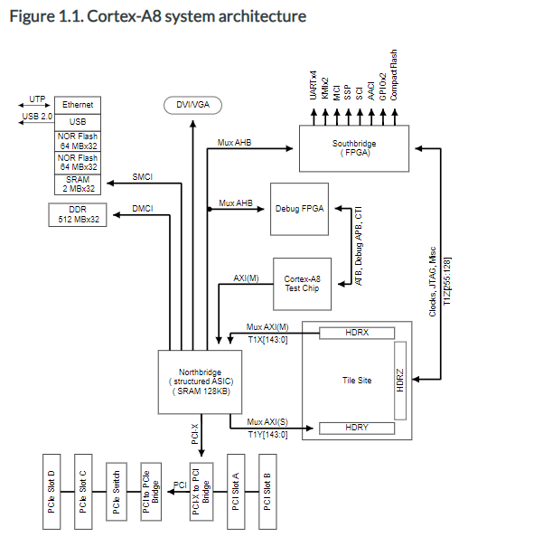

임베디드 운영체제 : 나빌로스를 구현하고 학습하는 데에 목표가 존재합니다.

1.1 운영체제 운영체제의 정의는 운영체제의 종류만큼 다양하지만 그 내용은 모두 비슷합니다. 일반적으로 운영체제란 하드웨어를 관리하고, 응용프로그램과 하드웨어 사이에서 인터페이스 역할을 하며 시스템의 동작을 제어하는 시스템 소프트웨어라고 정의됩니다. 

운영체제가 어떤일을 하는지는 그것을 구분하는 사람에 따라 차이가 있겠지만, 전반적으로 비슷하기 때문에 저는 다음과 같이 구분하겠습니다.

### 프로세스 관리

테스크, 프로세스, 스레드

스케줄링

동기화

IPC

### 저장장치 관리

메모리

가상 메모리

파일시스템

### 네트워킹 관리

TCP/IP

기타 여러 네트워크 프로토콜

### 사용자 관리

계정 관리

접근 권한 관리

### 디바이스 드라이버 

순차 접근 장치

임의 접근 장치

네트워크 장치


프로세스 관리란 운영체제에서 작동하는 응용프로그램을 관리하는 기능입니다.

어떤 의미에서는 프로세서(CPU)를 관리하는 것이라고 볼 수 있습니다.

현재 **CPU가 할당되어야 할 프로세스를 정의하고 이를 관리**합니다.

만약 CPU와 프로세서가 **여러 개일 때는 공유 자원 접근과 통신**등을 관리합니다.


저장장치관리란 1차저장장치인 메인메모리와 2차 저장장치인 스토리지 등을 관리하는 기능입니다.

메인 **메모리 관리는 프로세스에 할당하는 메모리 영역을 지정**하고 해제하는 **기본적인 기능과 각 메모리 영역간의 침범 방지 기능** 등을 말합니다. 그 외의 가상메모리를 제공하기도 합니다.

SSD 같은 2차 **저장장치는 파일 형태로 데이터를 저장**하고 이 데이터를 관리하는 **소프트웨어는 파일시스템**입니다.

운영체제는 서로 다른 파일 시스템간에 파일 교환을 지원하는 식으로 파일 시스템을 관리합니다.


네트워킹 관리는 TCP/IP 기반 인터넷에 연결하거나 다른 특별한 프로토콜 기반 **네트워크에 연결할 때** 응용프로그램이 네트워크를 사용하려면 **운영체제에서 네트워크 프로토콜**이 필요합니다.


사용자관리는 **운영체제는 한 컴퓨터를 여러 사람이 사용하는 환경을 지원**합니다. 이를 위해 운영체제는 각 계정을 관리하는 기능이 필요합니다. **사용자 별로 다른 사용자의 개인적 데이터를 접근할 수 없도록** 해야하고, 반대로 모든 사용자들이 접근해 읽거나 수정할 수 있는 데이터도 문제없이 동작하도록 관리해야합니다.


디바이스드라이버 운영체제는 시스템 하드웨어를 관리합니다. 해당 시스템에서는 여러 하드웨어가 붙어있습니다.

이들을 운영체제에서 인식하고 관리해서 사용할 수 있게 해야합니다. 이를 위해서 운영체제안에서 하드웨어를 연결하는 계층이 필요합니다. 이 계층을 디바이스 드라이버라고 합니다. 수많은 하드웨어 종류만큼 디바이스 드라이버도 종류가 많습니다. 결국 **운영체제는 디바이스 드라이버를 효율적으로 관리하는 기능**을 갖추어야 합니다.


## 임베디드 운영체제와 펌웨어

임베디드 컴퓨팅 장치를 **자기 자신의 고유하고 한정된 기능을 지속적으로 수행하는 독립된 장비**로 정의하면, 휴대용 장비 뿐만 아니라 자동차나 항공기, 대형 선박에 탐재한 제어 장치들도 임베디드 컴퓨팅 장치입니다.

결국 임베디드 컴퓨팅 장치도 소프트웨어가 있어야 동작합니다. 규모가 작거나 극단적인 최적화가 필요한 임베디드 장치는 운영체제 없이 펌웨어로만 동작하기도 합니다.  -> 아무리 운영체제를 잘 만들어도 운영체제가 동작하는 것도 하나의 소프트웨어이기 때문에 그만큼 성능이 떨어지게 됩니다. 그 작은 차이조차 최적화 하기 위해 운영체제가 없는 펌웨어로만 동작하기도 합니다.

하지만 시스템의 자원과 복잡도를 관리하는 것이 더 중요한 장치에서는 임베디드 운영체제를 사용하는 것이 일반적입니다. 하드웨어 성능이 좋아지면서 임베디드 운영체제를 사용해도 성능의 저하가 거의 없어졌기 때문에 대부분 임베디드 운영체제를 사용합니다.


리눅스나 원도우 같은 대형 운영체제도 PC에서 동작하는 소프트웨어의 일종인 것처럼 임베디드 운영체제도 임베디드 시스템에서 동작하는 펌웨어의 일종입니다. 임베디드 운영체제를 포함하는 임베디드 시스템용 전체 소프트웨어를 펌웨어라고 부릅니다.


## RTOS

실시간 운영체제라는 것은 운영체제의 응답과 동작이 즉각적이고 실시간이여야 해서 붙여진 이름입니다. 임베디드 운영체제는 대부분 RTOS로 구성되어 있습니다. RTOS가 아닌 임베디드 운영체제도 존재하지만 응답과 반응이 실시간으로 동작하지 않아도 되는 것이 허용되는 시스템 내부에서 동작하는 운영체제입니다.


## 나빌로스 

나빌로스라고 이름을 붙인 임베디드 운영체제를 개발할 예정이고, 임베디드 운영체제도 결국 일종의 펌웨어이기 때문에 책의 절반정도는 일반적인 펌웨어를 개발한느 과정이고 나머지 반정도는 최소한의 임베디드 운영체제에 대한 기능을 설계하고 구현하는 과정입니다.


나빌로스는 매우 작은 임베디드 소프트웨어이고, 임베디드 운영체제에 필요한 최소한의 기능만 포함시킵니다. 또한 펌웨어 개발에 어쩔 수 없이 사용해야하는 어셈블리 명령어에 관해서도 최소화하여 사용했습니다.


## 에뮬레이터 개발 환경

임베디드 소프트웨어를 개발할 때는 대상이 되는 하드웨어 장비가 있어야 합니다. 보통 개발 보드를 구입해서 해당 개발 보드에 맞춰 펌웨어를 만들면서 연습하는데 QEMU만 설치하면 추가 비용없이 펌웨어를 만들 수 있습니다.


## 리눅스 및 컴파일러 설치하기

임베디드 시스템에서 동작하는 펌웨어를 만들려면 해당 임베디드 시스템에 맞는 컴파일러를 사용해야 합니다.

ARM이면 ARM용 컴파일러를 사용해야하고 MIPS면 MIPS전용 컴파일러를 사용해야 합니다. 따라서 해당 ARM 컴파일러를 다운받아야 합니다. 이렇게 컴파일 실행하는 환경과 컴파일의 결과물이 실행될 환경이 다른 경우에 사용하는 컴파일러를 크로스 컴파일러 라고 합니다.


크로스 컴파일러로 GCC를 사용합니다. ( 회사에서는 ARMCC를 많이 사용합니다. )

sudo apt install gcc-arm-none-eabi

이름은 gcc-arm-플렛폼-ABI타입으로 이루어져 있고

플랫폼은 두가지의 타입이 존재합니다. linux와 none 입니다. 

none은 플랫폼이 없다는 뜻이며, 날 것 그 대로의 ARM 바이너리를 생성해준다는 뜻 입니다.


## QEMU 설치하기

QEMU는 x86, ARM 등 여러 환경을 가상 머신을 사용할 수 있는 애뮬레이터 입니다. 

sudo apt install qemu-system-arm

나빌로스를 만들 때는 ARM RealView Platform Baseboard를 에뮬레이팅한 머신을 사용합니다.



애뮬레이션 : 실제 보드와 똑같은 환경을 복사해놓은 전자기기 및 소프트웨어

시뮬레이션 : 어떠한 상황에 대해서 정책이나 성능 개선 방안에 대해 적용하고 그 결과를 탐구하는 것


# 3장

### 리셋 벡터

source code는 명령을 통해서 다운받을 수 있지만 직접 타이핑을 하는 것을 추천하기에 타이핑을 합니다.


arm 코어에 전원이 들어가면 ARM 코어가 가장 먼저 하는 일은 리셋 벡터에 있는 명령을 실행합니다.

리셋 벡터는 ? : 그냥 메모리 주소 0x00000000입니다. 정리해보면 메모리 주소 0x00000000부터 32비트를 읽어서 그 명령을 바로 실행합니다. 즉 처음에 할 일은 메모리 주소에 0x00000000에 명령어를 넣어주는 일입니다. 


Entry.S 

.text 부터, . end가 나올 때 까지 모든 코드가 text 섹션이라는 의미입니다. 

text 섹션을 알기 위해서는 실행파일의 형식을 알아야 합니다.

실행 파일이란 소프트웨어를 구성하는 요소를 파일 시스템에 바이너리로 만든 것입니다.


소프트웨어를 구성하는 요소는 기준에 따라 여러 가지로 나눌 수 있습니다.


데이터를 기준으로 소프트웨어의 구성 요소를 나눠보겠습니다. 그러면 데이터와 데이터를 변경하는 코드로 나눠잡는다.

우리가 프로그램을 만들 때 선언하는 변수가 데이터이고, 그 변수의 값을 변경하는 로직이 코드인 것입니다. 이 코드를 바이너리로 변경해서 모아 놓은 것을 실행 파일에서는 text 섹션이라고 합니다.

2번째 줄에 있는  .code 32는 명령어의 크기가 32비트라는 뜻입니다. global은 C언어 지시어인 extern과 같은 일을  합니다.

vector_start와 vector_end의 주소 정보를 외부 파일에서 심벌로 읽을 수 있게 설정하는 것입니다.

7번째 줄은 vector_start라는 레이블을 선언한 것입니다. 

8번째 줄은 MOV R0, R1은 아무련 의미가 없는 명령어 입니다.


R0와 R1은 각각 레지스터를 상징하며, 해당 이름은 R1.. R2... Rn... 이렇게 지어져 있습니다.

9번째 줄은 vector_end라는 레이블을 선언했고,

10번째 줄의 .space 1024, 0은 해당 위치부터 1024바이트를 0으로 채우라는 명령어 입니다.

11번째 줄은 text 섹션이 끝났다는 것을 알리는 지시어 입니다.


이렇게 된다면 어셈블리어로 리셋벡터를 설정한 것이고 이를 시각화 해서 결과를 관측해봅니다.

---

### 실행 파일 만들기

QEMU가 펌웨어 파일을 읽어서 부팅하려면 입력으로 입력한 펌웨어 바이너리 파일 이 ELF파일 형식이여야 합니다. ELF파일 형식이란 여러 실행 파일 형식 중에 대표적인 형식으로 리눅스의 표준 실행파일 형식입니다.방금 전 코드 3.2에서 arm-none-eabi-as 로 생성한 Entry.o 파일도 ELF 파일입니다. -> 그래서 바이너리만 뽑아내기 위해 arm-none-eabi-objcopy를 사용한 것 입니다. 

#### -> 왜 바이너리만 뽑아서 사용해야 하는 가 (의문)


ELF파일을 만들려면 링커(linker)의 도움이 필요합니다. 링커는 여러 오브젝트 파일들을 묶어서 (linking) 하나의 실행파일로 만드는 프로그램입니다. 오브젝트 파일들을 여러가지 만들고 이를 링킹 시켜서 실행파일을 만드는 과정은 윈도우나 리눅스의 실행파일을 만드는 과정과 완전 동일합니다.


이러한 링커가 동작하기 위해서는 링커 스크립트 라는 파일이 필요합니다. (링커 스크립트 코드가 필요함)

다음 나오는 코드는 링커 스크립트 코드로 가장 간단한 형태의 링커 스크립트입니다.

소스코드 디렉토리 트리의 최상위 디렉토리에 저장합니다. 보통 윈도우나 리눅스용 어플리케이션을 만들 때는 링커에 신경을 쓰지 않습니다. 왜냐하면 사용하는 윈도우나 리눅스의 링커 스크립트가 해당 OS의 라이브러리에 기본 값으로 포함되어 있기 때문입니다. 

하지만 펌웨어를 개발할 때는 해당 펌웨어가 동작하는 하드웨어 환경에 맞춰서 펌웨어의 섹션 배치를 세세하게 조정해야 할 일이 많이 있습니다. 따라서 링크 스크립트로 링커의 동작을 제어하여 원하는 형태의 ELF 파일을 생성합니다.


```
ENTRY(vector_start)
SECTIONS
{
	. = 0x0;
	
	.text :
	{
		*(vector_start)
		*(.text .rodata)
	}
	.data:
	{
		*(.data)
	}
	.bss:
	{
		*(.bss)
	}
}
```

1번째 줄의 ENTRY 지시어는 시작 위치의 심벌을 지정합니다. (심벌이 머지?)

2번째 줄의 SECTIONS 지시어는 3~20번째 줄까지의 블록이 섹션배치 설정정보를 가지고 있는 것이라고 알려주는 것 입니다. 4번째 줄의 .=0x0;는 첫 번째 섹션이 메모리 주소 0x00000000에 위치한다는 것을 알려줍니다.

7번째 줄의 .text는 text섹션의 배치 순서를 결정합니다. 추가 정보가 없다면 링커는 시작 주소부터 순서대로 섹션 데이터를 배치합니다. 

메모리 주소 (0x00000000)에 리셋 벡터가 위치해야 하므로 vector_start(리셋 벡터 변수) 심벌이 먼저 나오게 됩니다. 이어서 .text 섹션을 적고 data 섹션과 bss  섹션을 연속된 메모리에 배치하도록 설정하였습니다.

​	그러면 링커로 실행 파일을 만들어 보도록 합니다.

```
$ arm-none-eabi-ld -n -T ./navilos.ld -nostdlib -o navilos.axf boot/Entry.o
$ arm-none-eabi-objdump -D navilos.axf
```

arm-none-eabi-ld로 실행 파일을 만들었습니다. -n은 링커에 섹션의 정렬을 자동으로 맞추지 말라고 하는 옵션입니다. (섹션의 정렬은 무엇일까 ?)

-T는 링커 스크립트의 파일명을 알려주는 옵션입니다.  -nostdlib 명령은 링커가 자동으로 표준 라이브러리를 링킹하지 못하도록 지시하는 옵션입니다. 링커가 동작을 완료하면 navilos.axf 파일이 생성됩니다. 해당 파일을 2번째 줄에서 arm-none-eabi-objdump -D 명령으로 디스어셈블 해서 내부가 어떻게 되어 있는지 출력해봅니다.

-> 디스어셈블 ?! 은 무엇일까 

내부를 살펴보면 vector_start는 0x0000000에 잘 배치되어 있고 mov r0, r1으로 명령어가 실행되게 끔 되어 있다

이것은 리셋 벡터를 설정할 때 만들어 준 코드 !!


### QEMU에서 실행해보기

실행 파일을 만드는데 성공했습니다. 그러나 이걸 실행 파일이라고 부르고 있을 뿐 실행하면 실행이 되지 않습니다. -> 포멧팅 에러가 나오게 됩니다.

ELF 파일 포맷으로 만든 실행파일이 분명하지만, 리눅스 커널에서 동작하지 않는 섹션 배치로 만들어져 있어서 그렇습니다. 게다가 리눅스용 라이브러리가 하나도 없습니다. -> 두가지의 방법이 존재합니다.

1. 실제 ARM 개발보드에 다운로드를 시켜서 동작을 확인하는 방법
2. QEMU로 실행해보는 방법 입니다.

QEMU로 해당 부분을 실행시켜보겠습니다.

$qemu-system-arm -M realview-pb-a8 -kernel navilos.axf -S -gdb tcp::1234,ipv4

-M 옵션을 통해서 머신을 지정해줍니다. 저희의 머신은 RealViewPB 이므로 -kernel 옵션으로 ELF 파일 이름을 지정합니다. -kernel 옵션으로 ELF 파일 이름을 지정합니다. -S 옵션은 QEMU가 동작하자말자 바로 일시정지 되도록 지정하는 옵션입니다.

-gdb tcp::1234,ipv4는 gdb와 연결하는 소켓 포트를 지정하는 옵션입니다.  -S 옵션과 -gdb옵션은 gdb와 연결해서 디버깅을 하려고 사용하는 옵션입니다. 굳이 해당 옵션을 사용한 이유는 QEMU로 실행시켜봤자 아무것도 나오지 않기 때문에 실제로 뭐가 실행되는지 전혀 알 수 없기 때문입니다.  -> gdb 보고 판단 가능

그래서 gdb를 통해서 메모리를 확인해봐야 제대로 동작하는지 알 수 있습니다. 


-> gdb다운 받고 이를 통해서 확인이 가능합니다.

sudo apt install gdb-multiarch 를 다운 받고

해당 realview를 키고난 이후 (포그라운드 실행이라 다른 작업 불가능) 다른 터미널에서 

$ gdb-multiarch 를 치고난 이후 target remote:1234라고 타이핑 합니다.

1234는 연결하는 포트 넘버이며 이는 realview의 에뮬레이터와 동일해야 합니다.

x/4x 0 을 치면 메모리 주소에서 0000에서 4바이트를 4개 출력해줍니다.


결국 펌웨어 바이너리가 QEMU에서 동작하는 것을 확인했습니다. 이 과정의 반복이 결국 펌웨어와 RTOS를 개발하는 과정입니다.

 

### 빌드 자동화 하기

navilos.axf 파일을 얻기 위해서는 arm-none-eabi-as로 어셈블리어 파일을 컴파일 하고 arm -none-eabi-ld로 링킹을 해야합니다. 새롭게 컴파일 하는 파일이 나오게 된다면 링킹을 다시 반복해야합니다. 따라서 이를 Makefile을 통해서 빌드 자동화를 해야합니다. 

펌웨어 개발이라고 해서 Makefile이 특별한 다른 것은 없습니다. 컴파일러처럼 ARM용을 따로 설치할 필요조차 없습니다. 


armv7-a, cortex-a8 은 각각 아키텍쳐와 CPU 정보를 나타냅니다.

해당 정보는 마지막에 사용됩니다. (빌드 시)

4번째 줄부터 7번째 줄에는 크로스 컴파일러 실행파일의 이름을 적어놨습니다. -> 크로스 컴파일에 관여하는 여러 유틸리티들을 묶어서 툴체인이라고 부르기도 합니다. 9번째 줄에는 링커 스크립트의 이름이 있습니다.

11번째와 12번째 줄은 어셈블리어 소스파일 목록과 오브젝트 파일 목록이 있습니다. 바로 이해할 수 없는 이상한 명령어로 11번째와 12번째에 채웠는데 이는 make 파일의 빌트인 함수입니다.


11번째 줄은 boot디렉토리에서 확장자가 S인 파일 이름을 모두 ASM_SRCS 변수에 넣으라는 의미입니다.

12번째 줄은 boot 디렉터리에서 확장자가  S인 파일 이름을 찾아서 확장자를 o로 바꾼다음 디렉터리도 build로 바꿔 ASM_OBJS 변수에 값으로 넣으라는 말입니다.  

결국 ASM_SRCS는 boot/Entry.S를 저장하고 있고, ASM_OBJS는 Build/Entry.o를 저장하고 있습니다.


14번째 15번째 줄에는 최종 목표 ELF 파일이름과 바이너리 파일이름을 적어 놓습니다. 24~25번째 줄은 QEMU를 실행시키는 명령어 입니다.


27번째 28번째 줄은 QEMU와 gdb를 연결할 때 사용하는 명령어입니다.

33~35번째 줄은 링커로 navilos.axf 파일을 생성하는 명령입니다.

추가로 navilos.bin도 생성합니다.

37~39번째 줄은 자동으로 S 파일을 o파일로 컴파일 하는 명령어 입니다.


### 하드웨어 정보 읽어오기 - 데이터시트를 읽는 방법


소프트웨어란 결국 하드웨어와 상호작용하는 것이 목적입니다. 펌웨어는 하드웨어와 더 밀접하게 묶여 있습니다. 그렇기 때문에 펌웨어를 개발할 때는 윈도우나 리눅스에서 소프트웨어를 개발하는 것보다 하드웨어를 더 많이 그리고 더 자세히 알아야 합니다. 하드웨어와 상호작용을 한다는 것은 결국 하드웨어에서 정보를 읽어오고 하드웨어에 정보를 쓰는 것입니다. 

-> 이는 결국 하드웨어의 레지스터 사용법을 알아야 합니다. 하드웨어의 레지스터 사용법은 레지스터 데이터 시트에 나와 있습니다. 데이터 시트라는 것은 해당 하드웨어가 가지고 있는 레지스터의 목록과 설명, 그리고 레지스터에 어떤 값을 썻을 때 하드웨어가 어떻게 동작하는지를 적어놓은 문서입니다.


펌웨어 개발자는 자신이 개발하고 있는 대상 하드웨어의 데이터시트를 항상 찾아보며 펌웨어를 만들어야 합니다.

 하드웨어에서 정보를 읽어오는 가장 간단한 작업을 해보겠습니다. 코드 3.8은 하드웨어에서 정보를 읽어오는 코드입니다.

Entry.S 파일의 8번째 9번째 명령어를 수정하는데, 

LDR R0, =0x10000000 명령을 쓰고

-> 레지스터 0에 0x10000000의 숫자를 넣어라.

LDR R1, [R0]

-> R0에 저장된 메모리 주소에서 값을 읽어서  R1에 넣으라는 것입니다.

메모리 주소 0x10000000에 무슨 값이 있는지는 데이터시트를 봐야한다. RealViewPB는 ARM에서 파는 물건인 만큼 ARM사에서 운영하는 곳에서 데이터시트를 구할 수 있습니다.

RealView PB의 데이터 시트에서 레지스터 주소를 찾으면 ID Register라고 나옵니다.

해당 레지스터는 하드ㅜ웨어를 식별할 수 있는 정보를 가진 레지스터입니다. (읽기 전용임)

거의 모든 하드웨어가 이런 류의 레지스터를 가지고 있습니다. 주로 펌웨어가 여러 하드웨어를 대응해야할 때 사용합니다.

여러 하드웨어에 같은 펌웨어를 사용한다면 펌웨어는 지금 동작하고 있는 하드웨어가 무엇인지 알아야 합니다.

이럴 때 ID Register와 같은역할을 하는 레지스터에서 고윳값을 일고 하드웨어를 구분합니다. 그러므로 당연히 RealViewPB의 ID Register에도 어떤 고윳값이 들어가 있어야 합니다. 일단 데이터 시트에 있는 ID Register의 구조를 보도록합니다. 

데이터시트에 있는 ID Register의 구조를 볼때 RealViewPB는 ID Register의 이름을 SYS_ID라고 합니다.

총 32비트를 사용하며, 0부터 7비트까지는 FPGA를 사용 8에서 11비트까지 ARCH 사용 12에서 15비트까지 BUILD 사용 16~27까지의 비트는 HBI를 나머지 28부터 31까지는 REV로 사용합니다. (8, 4, 4, 12, 4비트 씩) 할당

각 항목이 어떤 의미를 가지고 있는지 데이터 시트에 설명되어 있습니다.


REV : 보드버전을 상징

HBI : HBI 보드번호

BUILD : 보드 빌드 변형

ARCH : 버스 아키텍쳐

FPGA : FPGA 빌드

-> 설명은 되어 있으나 잘 모르는 말들 .. 원래 그런 것이고 데이터 시트는 받아들이는 것임

예제는 없고 설명밖에 없음 만약 잘 모르겠으면 애플리케이션 노트를 찾아봐야함 나중에 하드웨어로 실전 프로젝트를 진행할 때는 어플리케이션 노트가 필요할 수도 있습니다.

-> 이제 SYS_ID를 보드에 데이터 시트를 참고해서 레지스터를 통해서 연결을 시켰고, 여기서 제대로 동작하는지 확인을 해야합니다.  -> 쉽게 보기 위해 기본 값이 존재하는 항목의 값이 들어갔는지 체크하는 절차를 통해서 알아봅니다.

디버깅 화면에서 사용할 수 있는 명령어

step, info register, list

info register : 현재 레지스터의 정보

-> step 명령어 실행

info register r0에 해당하는 메모리값이 변동됨

-> step 명령어 실행

info register r1에 해당하는 메모리 값이 변동됨

바뀌는 이유 : Entry.S에서 처음 스텝으로는 R0에 0x10000000을 넣어라는 말이며

다음 스텝으로는 R0에 있는 값을 R1을 넣으라는 이야기 입니다.


축약명령어도 지원하기 때문에 info register 대신 i r 를 쳐도 인정이 됩니다.

레지스터에 해당하는 금액은 R1에 0x1780500이라는 값이 들어가게 되었는데

이것을 2진수로 변경시켜보면 다음과 같습니다.

00000001 0111000 00000101 00000000 32비트 값으로 

REV : 0000 0x0

HBI : 000101111000 0x178

BUILD : 0000 0x0

ARCH : 0101 0x5

FPGA : 00000000 0x00

데이터 시트에서 보인 HBI와 ARCH 항목의 기본값이 일치합니다. 펌웨어가 읽은 결과를 해석하면 보드 리비전은 Rev A, 버스 아키텍쳐 AXI 임을 알 수 있습니다. 결국 펌웨어와 QEMU가 동작하는 것을 확인할 수 있습니다.

-> 기본값 설명에 보면 나와 있음


준비과정은 종료되고 이제 부팅하기 시작.

## 부팅하기

컴퓨터를 켜서 윈도우나 리눅스 로그인 화면 혹은 데스크톱 화면이 나오기 까지의 과정을 부팅이라고 합니다.

펌웨어는 어디까지를 부팅이라고 해야할까요. 보통 부팅이라고 하면 시스템에 전원이 들어가서 모든 초기화 작업을 마치고 펌웨어가 idle한 상태가 될 때까지를 말하거나, 시스템에 전원이 들어가고 ARM 코어가 리셋 익셉션 핸들러를 모두 처리한 다음에 본격적으로 C언어 코드로 넘어가기 직전까지를 말합니다. 

-> ARM코어가 리셋 익셉션 핸들러를 모두 처리한 다음(이해하기 위해서는 다음 챕터)

보통은 전자까지를 부팅이라고 표현하나, 단계를 표현하기 위해서 후자를 부팅이라고 표현하겠습니다.


4.1 메모리 설계

보통 임베디드 시스템은 메모리 구조가 꽤 복잡합니다. 성능과 비용사이에서 최적의 결과를 내기 위해 다양한 메모리 종류를 섞어 쓰기도 하기 때문입니다. 하지만, QEMU는 아주 단순한 메모리 구조로 되어 있습니다. 그리고 용량 제한없이 설정하는 만큼 사용할 수 있습니다. -> 애물레이터이기 때문이고, 실제로는 복잡함

아무런 옵션을 주지않고 실행하면 128MB를 메모리로 할당시켜줌.

임베디드 시스템에서 펌웨어가 128MB 정도의 메모리를 사용하는 경우는 별로 많지 않음

실행파일은 메모리를 크게 3단계로 나눠서 사용합니다.

- text 영역 : 코드가 있는 영역, 임의로 변경하면 안됨
- data 영역 : 초기화한 전역변수가 있는 공간, 전역 변수를 선언할 때 초기 값을 할당해서 선언하면 해당 전역 변수가 점유하는 공간은 여기에 할당 됩니다.
- BSS 영역 : 초기화하지 않은 전역변수가 있는 공간입니다. 초기화 하지 않은 전역 변수이므로 빌드 완료되어 생선된 바이너리 파일에는 심벌과 크기만 들어 있습니다.

이제 text, data, BSS 영역을 어떻게 배치할까 고민해봅니다. 만약 임베디드 시스템이 속도는 빠르지만 용량이 작은 메모리와 속도는 느리지만 용량이 큰 메모리를 가지고 있다면, text 영역은 속도가 빠른 메모리에배치하고, ㅇatat 중에서도 속도에 민감한 데이터들은 링커에게 따로 정보를 주어서 빠른 메모리에 배치해야합니다.

-> 속도에 민감한 데이터들은 링커를 설정하여 메모리별 배치가 가능하다.

QEM는 크기를 신경쓰지 않아도 되지만 실무를 가정하여, 방법을 흉내를 내려고 합니다.


 첫 번째로 text 영역입니다. 리눅스 같은 거대한 운영체제를 사용하지 않을 것이므로 RTOS를 사용하는 펌웨어는 많아야 수십 KB정도면 충분합니다. ㅎ자미ㅏㄴ 우리는 메모리가 넉넉하므로 text영역에  1MB를 할당하겠습니다.

익셉션 벡터 테이블을 text 영역에 포함시킬 것이므로 시작주소는 0x00000000입니다.

크기를 1MB로 설정하면 끝나는 주소는 0x000FFFFF입니다.


익셉션 벡터 테이블이란 ?


ARM 프로세스에는 7가지 Exception Mode가 존재한다. ARM 프로세서는 메모리주소 0x00000000 번지를 이 7가지 Exception을 처리하기 위한 벡터 테이블로 예약하놓고 있다. 7가지 Exception은 다음과 같다.


1. Reset
2. Undefined instruction
3. Software Instruction
4. Prefetch Abort
5. Data Abort
6. Reserved
7. Interrupt Request
8. Fast Intrrupt Request

각 익셉션이 어떨 때 발생하는 가는 인터넷을 찾아보면 매우 잘 나온다. 

이러한 표 자체를 벡터 테이블이라고 부른다. ARM 프로세서는 위 표에 해당하는 7개의 Exception 중 하나가 발생하면 자동으로 옆에 있는 벡터 주소에 명시된 주소로 PC를 점프한다. 예를 들면 프로그램 실행 도중 IRQ가 발생하면 당장에 0x00000018 번지로 점프한다는 것이다.


벡터 주소를 잘 보면 각 주소가 4바이트씩 떨어져 있음을 알 수 있다. ARM에서 어셈블리 명령어 하나는 각각 4바이트를 차지한다. 저 벡터 테이블에는 각 Exception 별로 명령어 한 개 씩 밖에 들어가지 못한다는 것이다. 그래서 저 벡터 테이블에는 브랜치 명령이 들어가 있고 

